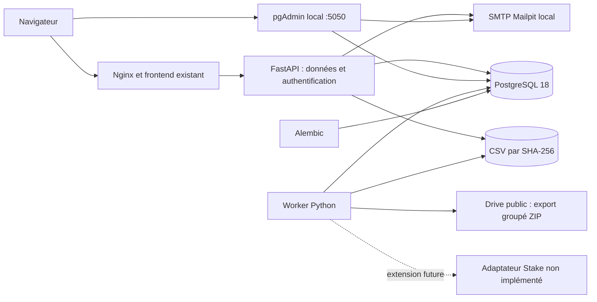

# Backend, collecte et exploitation

Périmètre autorisé le 15 septembre 2026 : backend réel, Docker et authentification par code email dans le frontend, avec Mailpit local. Aucun accès à Stake.bet. L’audit temporaire est conservé dans [oracles-elixir-audit.md](oracles-elixir-audit.md). Voir [authentication.md](authentication.md) pour les sessions, les limites et la configuration SMTP.

## Architecture



- `apps/api` : routes HTTP synchrones exécutées dans le pool de threads FastAPI, validation Pydantic, connexions SQLAlchemy. Aucune dépendance à Patchright ou au worker.
- `apps/worker` : découverte, export avec Patchright/Chromium, téléchargement HTTPX, validation et import. Un processus de planification suffit pour cette source ; PostgreSQL fournit le verrou distribué et les journaux durables. Pas de Redis ou de file de tâches sans usage actuel.
- `packages/core` : configuration, contrats, modèles SQLAlchemy, administration du catalogue et stockage des cotes.
- `migrations` : migrations Alembic versionnées, exécutées avant les services. Aucune création implicite de tables au démarrage de l’API.
- `apps/web` : données esport conservées en mock, authentification réelle dans une modale. Les imports Python et les secrets ne sont jamais embarqués dans le bundle frontend.
- `pgadmin` : administration locale de PostgreSQL, authentification indépendante et connexion au réseau interne de la base. Son volume de configuration est distinct des données métier.

L’image API contient les dépendances HTTP et base ; l’image worker contient le navigateur. Les deux applications s’exécutent sous l’UID 10001. Nginx s’exécute sous son utilisateur non privilégié. L’API et Nginx ont un système de fichiers en lecture seule. Les données PostgreSQL et les CSV sont dans deux volumes distincts. L’API monte les CSV en lecture seule ; son rôle SQL lit les données esport et écrit uniquement les tables/colonnes nécessaires à l’authentification, sans pouvoir attribuer de rôle. Le worker écrit les données de collecte mais n’accède pas aux tables d’authentification. Le rôle propriétaire est réservé aux migrations et à l’administration.

## Démarrage Docker

```sh
npm run docker:init
npm run docker:up
docker compose --env-file .env.docker ps
```

Application : `http://127.0.0.1:8080`. OpenAPI : `http://127.0.0.1:8080/api/docs`. Les images de base sont épinglées par digest ; les dépendances sont verrouillées dans `package-lock.json` et `uv.lock`.

Le projet Compose s’appelle `metiquo-stack`, pour ne pas réutiliser les anciens volumes `metiquo_*`. Les volumes créés sont `metiquo-stack_postgres_data`, `metiquo-stack_artifacts` et `metiquo-stack_pgadmin_data`. Un autre projet Compose peut être utilisé avec `-p`.

Au premier lancement, le worker synchronise le catalogue LoL et ses logos, puis découvre les fichiers Oracle disponibles et importe l’historique complet. Les relances utilisent les dates des collectes réussies en base : elles ne déclenchent pas systématiquement un nouvel export. L’API reste disponible pendant les collectes. Les noms, options, cadences et usages cron sont détaillés dans [le guide des collecteurs](collectors.md).

### pgAdmin et accès à PostgreSQL

pgAdmin 4 est ajouté comme service `pgadmin`, avec une image versionnée et épinglée par SHA-256. Il écoute uniquement sur `http://127.0.0.1:5050`. Le navigateur passe par ce port local ; pgAdmin joint PostgreSQL à travers le réseau Docker `database`. PostgreSQL reste sans port publié dans la stack standard.

Pour l’ajouter à une installation existante :

```sh
npm run docker:init
docker compose --env-file .env.docker up -d pgadmin
```

`docker:init` ajoute les paramètres pgAdmin manquants sans remplacer les mots de passe ou les réglages présents. Il peut être relancé. Un fichier ayant déjà une clé avec une valeur vide n’est pas écrasé : renseigner cette valeur explicitement avant démarrage.

| Accès                     | Identifiant                                            | Mot de passe                                  |
| ------------------------- | ------------------------------------------------------ | --------------------------------------------- |
| Interface pgAdmin         | `PGADMIN_DEFAULT_EMAIL`, par défaut `admin@metiquo.fr` | `PGADMIN_DEFAULT_PASSWORD` dans `.env.docker` |
| PostgreSQL administrateur | `metiquo`                                              | `POSTGRES_PASSWORD` dans `.env.docker`        |

Le serveur **Metiquo — PostgreSQL** est importé au premier démarrage : hôte `db`, port `5432`, base de maintenance `metiquo`, utilisateur `metiquo`. Développer le serveur, saisir le mot de passe PostgreSQL, puis ouvrir **Databases → metiquo → Schemas → public → Tables**. Le fichier versionné `infra/docker/pgadmin/servers.json` contient seulement les paramètres de connexion ; aucun mot de passe.

Le compte pgAdmin, le rôle PostgreSQL et le compte de l’application sont trois accès indépendants. Le rôle `metiquo` administre toute la base ; les rôles restreints de l’API et du worker restent propres à leurs services. Pour une connexion depuis un autre client installé sur Windows, utiliser l’override `compose.dev.yaml` documenté plus bas : `127.0.0.1:54329`, mêmes base/utilisateur/mot de passe. Le nom `db` fonctionne à l’intérieur de Docker.

Configuration locale : `PGADMIN_PORT=5050`, `PGADMIN_DEFAULT_EMAIL=admin@metiquo.fr` et un `PGADMIN_DEFAULT_PASSWORD` aléatoire distinct. Les deux variables `PGADMIN_DEFAULT_*` créent le compte initial ; les modifier après initialisation ne change pas le compte conservé dans le volume. Les changements ultérieurs se font dans pgAdmin. Les emails de récupération sont dirigés vers Mailpit, sans livraison externe.

Le volume `pgadmin_data` conserve les comptes, serveurs, préférences, sessions et fichiers de travail. Les serveurs ne sont pas remplacés à chaque démarrage, afin de préserver les réglages utilisateur. `docker:down` conserve ce volume. Sa sauvegarde est distincte de celle des données PostgreSQL et des artefacts ; arrêter pgAdmin pendant la copie de son volume pour conserver sa base SQLite de configuration cohérente.

Le service s’exécute sous l’utilisateur non privilégié de l’image, sans capacités Linux supplémentaires. Une sonde `/misc/ping` vérifie pgAdmin ; PostgreSQL dispose de sa propre sonde. Le cookie de session pgAdmin possède un nom distinct de celui de l’application. Références : [déploiement officiel en conteneur](https://www.pgadmin.org/docs/pgadmin4/9.17/container_deployment.html) et [format des connexions préconfigurées](https://www.pgadmin.org/docs/pgadmin4/9.17/import_export_servers.html).

### Commandes utiles

```sh
docker compose --env-file .env.docker logs --tail 100 worker
docker compose --env-file .env.docker run --rm --no-deps worker metiquo-worker sync-lol-catalog
docker compose --env-file .env.docker run --rm --no-deps worker metiquo-worker sync-oracles-elixir
docker compose --env-file .env.docker run --rm --no-deps worker metiquo-worker sync-oracles-elixir --latest
docker compose --env-file .env.docker run --rm migrate alembic current
npm run docker:down
```

Une collecte manuelle échoue avec un code non nul si une autre possède déjà le verrou. Une année seule entraîne aussi le téléchargement d’un fichier compagnon, choisi dynamiquement parmi les autres années, afin d’utiliser l’export groupé. Les deux fichiers sont validés et importés ; une empreinte déjà connue ne duplique pas les lignes.

### Catalogue réel et futur mode API

Le backend ne charge aucun fichier du frontend au démarrage. `sync-lol-catalog` collecte directement Riot et publie le catalogue avec ses logos ; c’est la commande normale, manuelle ou planifiée. Le snapshot historique du frontend peut toujours être importé explicitement à des fins d’administration, sans importer les rencontres ou cotes fictives :

```sh
docker compose --env-file .env.docker run --rm --no-deps -v "./apps/web/src/mocks/data/catalog.json:/import/catalog.json:ro" migrate metiquo-admin catalog-import /import/catalog.json
```

L’import d’administration valide les identifiants uniques et les références équipe → ligue, puis ajoute/met à jour les identités en transaction. Les identités historiques restent en base pour préserver les références de rencontres. Cet import ne télécharge aucun logo et désélectionne la version collectée, sans la supprimer ; il utilise le même verrou que le collecteur. Il reste distinct de la synchronisation automatique. Sans catalogue publié ou importé, `/catalog` renvoie explicitement 503. Le mode API ne fabrique pas de catalogue ou d’opportunités.

La configuration Docker reste `VITE_DATA_MODE=mock`. Les nouvelles images backend sont servies par `/api/v1/catalog/logos/{sha256}.webp` depuis le volume partagé, sans reconstruire le frontend. Avant sa future bascule API, présenter la distinction entre ligue d’origine et participation exposée dans le référentiel enrichi. Les variables Vite restent des paramètres de compilation, pas des secrets ni des paramètres lus dynamiquement par Nginx.

## Collecte Oracle’s Elixir

1. Lire l’inventaire public du dossier Drive. Reconnaître les noms annuels ; ne pas coder une liste fermée d’années ou d’identifiants de fichiers.
2. Ouvrir une session Chromium anonyme, sélectionner les lignes et utiliser l’action groupée `Download`.
3. Capturer le lien d’archive réellement généré sur `storage.googleapis.com/drive-bulk-export-anonymous/`. Aucun cookie de compte, clé privée ou URL signée permanente n’est nécessaire. L’URL temporaire n’est pas enregistrée en base.
4. Télécharger en flux, avec limites de taille et de délai réseau. Vérifier longueur et MD5 GCS lorsqu’ils sont fournis, puis le CRC de chaque membre ZIP.
5. Exiger l’inventaire exact : pas de doublon, fichier supplémentaire, chemin de sortie, archive chiffrée ou import partiel. Une archive divisée par Google ou une sélection incomplète échoue explicitement.
6. Vérifier UTF-8, en-têtes uniques, colonnes minimales requises, largeur de chaque ligne et présence de données. Les nouvelles colonnes restent acceptées et conservées.
7. Conserver chaque CSV sous `sha256/<préfixe>/<empreinte>.csv`, puis importer par `COPY` PostgreSQL en flux. Les nouvelles versions et tous les pointeurs actifs sont publiés dans **une même transaction**. Une erreur laisse les anciennes versions consultables.

Les ZIP et fichiers de préparation sont temporaires et supprimés à la sortie normale ou sur exception Python. Un arrêt forcé du conteneur pendant l’import provoque le rollback PostgreSQL ; le prochain worker marque l’exécution abandonnée `interrupted`. Une recréation du conteneur supprime également ses éventuels fichiers temporaires laissés par un arrêt forcé.

Le worker vérifie le dernier fichier toutes les six heures et tous les fichiers chaque semaine : les archives historiques peuvent être corrigées par la source. Les nouvelles tentatives après échec attendent 1, 2, 4, 8, 16 puis 30 minutes au maximum. Les échecs sont visibles dans les logs et dans `/sources/oracles-elixir`. Le rythme ne cherche pas à multiplier les comptes ou les adresses IP.

### Modèle des données

| Table                                                  | Contenu                                                                                                                 |
| ------------------------------------------------------ | ----------------------------------------------------------------------------------------------------------------------- |
| `ingestion_runs`                                       | Source, périmètre, début/fin, état, catégorie d’erreur, années importées/inchangées                                     |
| `datasets`                                             | Identité du fichier annuel, ID Drive, nom, année du fichier, version active, dernière vérification                      |
| `dataset_versions`                                     | Empreinte, chemin du CSV, taille, nombre de lignes, colonnes, collecte d’origine                                        |
| `oracle_rows`                                          | Version, numéro de ligne, game ID, participant ID, toutes les valeurs d’origine en JSONB                                |
| `catalog_metadata`, `leagues`, `teams`                 | Référentiel sourcé importé explicitement ; identifiants ouverts                                                         |
| `catalog_versions`                                     | Documents immuables du référentiel LoL, preuves, affiliations datées et images ; pointeur actif dans `catalog_metadata` |
| `matches`, `markets`                                   | Identités source, équipes, format, début, date d’enregistrement et sélections Stake                                     |
| `odds_observations`                                    | Cotes décimales par marché et date ; clé unique pour rendre la livraison répétée idempotente                            |
| `probability_estimates`                                | Probabilité, version du modèle, date d’estimation et expiration                                                         |
| `app_users`                                            | Identité interne, email normalisé, rôle et vérification ; identités externes historiques conservées                     |
| `auth_challenges`, `auth_sessions`, `auth_rate_limits` | Codes à usage unique, sessions révocables et compteurs persistants                                                      |

`file_year`, le champ CSV `year` et le champ CSV `date` sont distincts. Le JSONB conserve les chaînes originales, y compris valeurs vides et données partielles. Le fuseau horaire des dates CSV n’est pas attribué arbitrairement. Aucun rapprochement automatique n’est fait entre IDs Oracle et Riot. Le CSV conservé permet une réinterprétation ou un réimport ultérieur sans retourner sur Google.

Les anciennes versions sont conservées. Aucune purge automatique des données ou sauvegardes n’est exécutée. Prévoir de l’espace disque pour les CSV, JSONB, index, WAL PostgreSQL et versions successives ; la taille des CSV seuls ne représente pas la taille de la base.

## Emplacement pour Stake et authentification

`sources/stake.py` définit `OddsSource` et `SourceQuote`. `StakeSource.collect()` lève explicitement `NotImplementedError` ; aucun job Stake n’est enregistré. Aucune URL Stake, navigation, authentification ou requête Stake n’est exécutée.

Lors de son implémentation future :

1. Ajouter l’adaptateur Patchright dans le worker, avec son propre cycle de vie navigateur, délais et cadence. L’API ne doit jamais lancer un scrape lors d’une lecture utilisateur.
2. Résoudre les IDs source vers le référentiel interne, avec provenance et gestion des correspondances ambiguës. Ne pas fusionner des équipes sur un simple nom ressemblant.
3. Enregistrer la rencontre avant ses cotes, créer les marchés/sélections, puis appeler `record_quote` dans une transaction. Cette fonction verrouille le marché, vérifie l’appartenance de la sélection et rejette les relevés antérieurs à l’enregistrement ou contradictoires au même instant.
4. Produire les estimations dans un traitement distinct, avec version et expiration du modèle. `/opportunities` ne renvoie que les matchs à venir, marchés actifs, estimations valides et cotes de moins de 15 minutes par défaut. La dernière cote est dérivée du dernier relevé, même si elle baisse ; aucune value n’est stockée.

L’authentification email est implémentée dans `apps/api/src/metiquo_api/auth.py`, avec migration `0002`, Mailpit et modale frontend. Aucun mot de passe, compte bookmaker ou paiement n’est ajouté. Les favoris restent locaux et les routes esport restent publiques. Le détail des protections et des limites est dans [authentication.md](authentication.md).

## Configuration

Les paramètres Python commencent par `METIQUO_` et sont validés au démarrage. Aucun secret n’a de valeur de production par défaut.

| Variable                                | Défaut / usage                                                            |
| --------------------------------------- | ------------------------------------------------------------------------- |
| `METIQUO_DATABASE_URL`                  | Obligatoire ; DSN `postgresql+psycopg://...`, rôle distinct selon service |
| `METIQUO_ARTIFACT_DIR`                  | `.cache/backend/artifacts` localement, `/data/artifacts` sous Docker      |
| `METIQUO_LOG_LEVEL`                     | `INFO`                                                                    |
| `METIQUO_ORACLE_ENABLED`                | `true` ; `false` garde le worker en veille                                |
| `METIQUO_ORACLE_FOLDER_ID`              | Dossier public documenté dans les sources                                 |
| `METIQUO_ORACLE_INTERVAL_SECONDS`       | `21600`, minimum 300                                                      |
| `METIQUO_ORACLE_FULL_REFRESH_SECONDS`   | `604800`, minimum 300                                                     |
| `METIQUO_ORACLE_EXPORT_TIMEOUT_SECONDS` | `600`, maximum 1800                                                       |
| `METIQUO_ORACLE_MAX_ARCHIVE_BYTES`      | `1500000000`                                                              |
| `METIQUO_ORACLE_MAX_EXPANDED_BYTES`     | `5000000000`                                                              |
| `METIQUO_BROWSER_HEADLESS`              | `true` ; navigateur visible seulement pour diagnostic local               |
| `METIQUO_ODDS_MAX_AGE_SECONDS`          | `900` ; seuil de fraîcheur des futures cotes                              |

`.env.docker.example` décrit les paramètres Compose. Les mots de passe générés sont hexadécimaux, donc directement utilisables dans les DSN. Si des caractères réservés sont choisis manuellement, les encoder pour les URL. Modifier seulement les variables d’un volume PostgreSQL déjà initialisé **ne change pas ses mots de passe** : faire une rotation SQL coordonnée avec la configuration des services.

Un paramètre Python supplémentaire peut être injecté avec `docker compose run -e METIQUO_...=... worker ...` ou ajouté à `environment` du service correspondant. Un fichier `.env.docker` n’est pas automatiquement transmis intégralement aux conteneurs.

## Développement et vérification

```sh
uv sync --frozen
uv run patchright install chromium
docker compose --env-file .env.docker -f compose.yaml -f compose.dev.yaml up -d db
```

L’override de développement publie PostgreSQL sur `127.0.0.1:54329` et SMTP sur `127.0.0.1:1025`. Démarrer aussi `mailpit` pour la connexion. Définir `METIQUO_DATABASE_URL` dans l’environnement du terminal avec les identifiants locaux, puis les paramètres `METIQUO_AUTH_*` décrits dans [authentication.md](authentication.md) pour lancer l’API :

```sh
uv run alembic upgrade head
uv run uvicorn metiquo_api.main:create_app --factory --reload --host 127.0.0.1
uv run metiquo-worker sync-oracles-elixir --years 2026
npm run check
```

`npm run check` vérifie TypeScript, ESLint, les tests frontend, le build, Ruff, le format Python, mypy strict et les tests backend sans réseau. Les tests d’intégration utilisent une base séparée, dont le nom doit finir par `_test` ; ils réinitialisent ses tables, jamais la base de l’application :

```sh
docker compose --env-file .env.docker exec -T db createdb -U metiquo metiquo_test
# Définir TEST_DATABASE_URL avec la base metiquo_test et le port local 54329.
uv run pytest -m integration
uv run alembic check
```

Les tests réels des sources se lancent via les commandes `sync-lol-catalog` et `sync-oracles-elixir` ; la suite normale ne contacte ni Riot, ni Google, ni Stake. Pour une migration : modifier les modèles, générer avec `uv run alembic revision --autogenerate -m "Description"`, relire le SQL et tester sur la base isolée avant d’appliquer.

## Sauvegardes et futur serveur

Sauvegarder **ensemble PostgreSQL et le volume d’artefacts (CSV, pages source et logos)**. Pendant une sauvegarde cohérente, arrêter le worker, attendre la fin des collectes manuelles et ne lancer aucune commande d’administration. Réaliser un `pg_dump -Fc` de la base et une archive du volume d’artefacts ; sauvegarder séparément les secrets de restauration. Sous PowerShell ancien, ne pas rediriger un flux binaire avec `>` : écrire d’abord les archives dans le conteneur, puis utiliser `docker cp`.

Exemple pour la base, sans suppression de données :

```sh
docker compose --env-file .env.docker stop worker
node -e "require('node:fs').mkdirSync('.cache/backups', {recursive:true})"
docker compose --env-file .env.docker exec -T db pg_dump -U metiquo -d metiquo -Fc -f /tmp/metiquo.dump
docker compose --env-file .env.docker cp db:/tmp/metiquo.dump ./.cache/backups/metiquo.dump
docker compose --env-file .env.docker exec -T api python -c "import tarfile; archive=tarfile.open('/tmp/metiquo-artifacts.tar.gz','w:gz'); archive.add('/data/artifacts',arcname='.'); archive.close()"
docker compose --env-file .env.docker cp api:/tmp/metiquo-artifacts.tar.gz ./.cache/backups/metiquo-artifacts.tar.gz
docker compose --env-file .env.docker start worker
```

Le dossier `.cache/backups` est ignoré par Git ; déplacer les copies vers une sauvegarde privée durable. Prévoir assez de place dans `/tmp` pour les archives (en mémoire dans le conteneur API) ou utiliser un conteneur utilitaire avec un disque de sauvegarde monté. Restaurer le dump dans une **nouvelle base** avec `pg_restore`, avec les rôles initialisés par le script PostgreSQL et les mêmes migrations ; restaurer les CSV dans un nouveau volume avec l’UID/GID 10001. Vérifier les empreintes, `/health/ready`, les nombres de versions/lignes et un téléchargement CSV avant de basculer les services. Relancer ensuite le worker. Conserver une copie hors du serveur et tester périodiquement la restauration.

Pour un serveur, placer Nginx derrière une terminaison TLS et un domaine configurés explicitement, activer les cookies Secure et configurer l’origine et le fournisseur SMTP. L’écoute actuelle est locale ; modifier `WEB_BIND_ADDRESS` seulement pour le réseau choisi. Les routes esport sont publiques en lecture ; les routes d’authentification traitent des données privées. Les futurs endpoints privés devront contrôler les autorisations côté serveur. Prévoir sauvegardes automatisées, alertes et rotation des secrets. Ce travail ne publie rien sur Internet.

### Limites assumées

- L’export groupé testé évite le chemin individuel actuellement bloqué par quota. Google peut changer son interface, ses limites ou refuser un export ; aucun hébergement tiers ne permet une garantie de disponibilité absolue.
- La découverte reconnaît le tableau public actuel. Un changement de format, de pagination ou une archive fragmentée doit être traité explicitement ; une sélection différente est rejetée, jamais importée partiellement.
- La dernière version valide reste accessible pendant une panne. Sa date de récupération et sa dernière vérification sont exposées séparément ; disponible ne signifie pas à jour.
- Les lignes brutes ne sont pas encore un modèle prédictif, un calendrier temps réel ou un mapping universel des identités. Les endpoints d’opportunités restent vides sans les données nécessaires.
