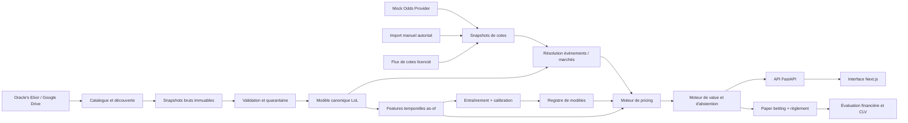

# Spécifications Fonctionnelles Générales — SaaS de détection de value bets esport

**Nom de travail :** Metiquo  
**Version :** 1.0  
**Date de référence :** 4 septembre 2026  
**Périmètre initial :** League of Legends  
**Déploiement initial :** usage personnel, auto-hébergé et entièrement Dockerisé  
**Évolutions prévues :** Counter-Strike 2, Dota 2, fonctionnement SaaS multi-utilisateur

---

## 0. Résumé de décision

Le produit n'est pas conçu comme un outil qui affirme simplement « l'équipe A va gagner ». Il doit agir comme un **moteur indépendant de pricing des marchés esport** :

1. il transforme l'historique League of Legends d'Oracle's Elixir en variables temporelles fiables ;
2. il estime une distribution de probabilités ou de résultats pour chaque marché pris en charge ;
3. il transforme cette estimation en **cote juste** ;
4. il récupère une cote bookmaker horodatée ;
5. il retire la marge du bookmaker lorsque toutes les issues du marché sont disponibles ;
6. il mesure l'écart entre le prix du marché et le prix du modèle ;
7. il ne publie une opportunité que si la fraîcheur, la qualité des données, la calibration du modèle, le mapping de l'événement et l'incertitude respectent des seuils stricts ;
8. il conserve le droit de répondre **« aucune value exploitable »**.

Une cote élevée n'est donc ni bonne ni mauvaise en elle-même. À titre d'exemple, une cote décimale de `4,00` représente une probabilité brute implicite de `25 %`. Si, après retrait de la marge, le marché valorise l'issue à `23,81 %`, que le modèle l'évalue à `30 %`, et que sa borne prudente est `27 %`, alors :

- cote juste du modèle : `1 / 0,30 = 3,33` ;
- EV brute : `0,30 × 4,00 - 1 = +20 %` ;
- EV prudente : `0,27 × 4,00 - 1 = +8 %`.

L'outil peut alors qualifier la cote de « value » sans jamais affirmer que le pari gagnera.

### Décisions structurantes

| Sujet | Décision retenue |
|---|---|
| Nature du produit | Moteur de pricing et de détection d'écarts, avec abstention possible |
| Source statistique LoL | Oracle's Elixir uniquement pour les statistiques historiques et les résultats LoL |
| Source des cotes | Interface générique `OddsProvider`, indépendante du bookmaker |
| Stake | Connecteur de production désactivé tant qu'une autorisation écrite et un cadre légal compatible ne sont pas obtenus |
| Exécution de paris | Exclue du MVP ; aucune mise automatique |
| Validation financière | Paper trading réel à partir des cotes collectées après mise en service |
| Historique de cotes | Jamais inventé ni reconstruit à partir des seules cotes actuelles |
| Mode mock | Même contrat API et mêmes composants UI que le mode réel |
| Architecture | Monolithe modulaire : Next.js + FastAPI + worker Python + PostgreSQL |
| Orchestration | Docker Compose et verrous PostgreSQL ; pas de Kubernetes, Kafka, Airflow ou feature store au MVP |
| Données brutes | Snapshots immuables, adressés par leur SHA-256, sur volume persistant ou stockage S3 compatible |
| ML | Modèles tabulaires calibrés, simples à auditer, comparés à un baseline de rating |
| Public SaaS | Porte de conformité obligatoire avant commercialisation |

---

## 1. Contraintes de conformité et portes de lancement

Cette section fait partie intégrante de la spécification. Elle ne constitue pas un avis juridique, mais définit les blocages produit qui empêchent de promettre une solution « 100 % fonctionnelle » dans un cadre incompatible avec les droits des sources.

### 1.1 Oracle's Elixir

Les fichiers téléchargeables d'Oracle's Elixir sont utilisables pour le prototype personnel et la recherche selon le cadre public actuellement présenté comme non commercial. Un SaaS payant ou exploité commercialement ne doit pas être lancé sans autorisation ou licence écrite couvrant explicitement :

- le téléchargement automatisé et répété ;
- le stockage et la transformation des données ;
- la création de probabilités, signaux ou produits dérivés ;
- l'accès par des utilisateurs tiers ;
- la monétisation et la durée de conservation.

**Porte OE-COMMERCIAL :** `NO-GO` tant que ces droits ne sont pas obtenus par écrit.

### 1.2 Politiques Riot Games

Le produit utilise l'univers League of Legends et produit une fonctionnalité directement liée aux paris. Les politiques publiques de Riot pour l'écosystème tiers interdisent actuellement aux produits de comporter une fonctionnalité de betting ou gambling.

**Porte RIOT-PRODUCT :** avant toute publication, obtenir une clarification écrite sur le périmètre applicable, enregistrer le produit si nécessaire et faire valider l'utilisation des marques, noms, visuels et données dérivées.

Aucun écran ne doit donner l'impression que le produit est officiel, partenaire de Riot ou approuvé par Riot. Le texte de non-affiliation requis devra apparaître dans les mentions légales si le produit devient public.

### 1.3 Stake et juridiction française

Le scraping Stake n'est pas retenu comme intégration de production conforme pour les raisons suivantes :

- les conditions de Stake interdisent notamment certains usages automatisés qui capturent, utilisent ou analysent les informations du site ;
- la France est citée dans leurs juridictions interdites ;
- à la date de cette SFG, Stake ne figure pas dans la liste française des opérateurs agréés pour les paris sportifs en ligne.

La spécification conserve un emplacement technique `StakeAuthorizedProvider`, mais celui-ci reste **désactivé par défaut et non livrable** tant que les trois conditions suivantes ne sont pas toutes remplies :

1. autorisation écrite de Stake pour l'accès automatisé et la réutilisation des cotes ;
2. utilisation depuis une juridiction licite, sans contournement géographique ;
3. validation juridique de l'usage et de la redistribution des données.

Aucun mécanisme de contournement de CAPTCHA, de protection anti-bot, de géoblocage, de proxy résidentiel, de fingerprinting ou de limitation de débit ne fait partie du produit.

### 1.4 Alternative de production

Le cœur applicatif doit fonctionner sans Stake. Les cotes sont apportées par l'une des implémentations suivantes :

- `MockOddsProvider` pour les démonstrations et les tests ;
- `ManualImportOddsProvider` pour un import CSV/JSON contrôlé ;
- `LicensedOddsFeedProvider` pour un flux disposant de droits contractuels ;
- connecteur d'un opérateur agréé, uniquement si son contrat ou son API autorise cet usage.

### 1.5 Garantie réaliste

Aucune application ne peut garantir la disponibilité ou la fraîcheur à 100 % d'un fichier tiers hébergé sur Google Drive. La garantie exigée du produit est la suivante :

> Le comportement de la pipeline est déterministe, observable et sûr : elle ne corrompt jamais la base, n'ingère jamais une page d'erreur HTML comme un CSV, conserve le dernier snapshot validé, indique explicitement son état de fraîcheur et peut échouer fermement lorsque l'option `--require-fresh` est activée.

---

## 2. Vision et objectifs

### 2.1 Vision

Fournir une interface fiable permettant de détecter les situations dans lesquelles le prix proposé par un bookmaker paraît supérieur au prix juste estimé par le modèle, tout en rendant visibles :

- la probabilité estimée ;
- la cote juste ;
- la probabilité implicite brute et sans marge ;
- l'EV attendue ;
- l'EV prudente ;
- l'incertitude ;
- l'âge des données et des cotes ;
- la version exacte du modèle et du dataset ;
- les raisons pour lesquelles le système recommande de s'abstenir.

### 2.2 Objectifs fonctionnels

Le produit doit :

- ingérer et historiser parfaitement les fichiers annuels Oracle's Elixir ;
- supporter un backfill complet et idempotent ;
- détecter les modifications rétroactives dans le fichier de l'année courante ;
- fabriquer des features « as-of » sans fuite du futur ;
- entraîner, calibrer, comparer et versionner les modèles par marché ;
- recevoir des événements et des snapshots de cotes ;
- faire correspondre de manière contrôlée les événements bookmaker et les entités historiques ;
- calculer puis classer les opportunités ;
- suivre les résultats en paper trading ;
- afficher les informations dans une interface rapide, lisible, accessible et sans clignotement ;
- fonctionner de façon identique en mode mock et réel ;
- être extensible à d'autres jeux sans réécriture du cœur.

### 2.3 Non-objectifs du MVP

Sont explicitement exclus :

- la promesse de profit ou de victoire ;
- l'exécution automatique de paris ;
- la gestion de dépôts, retraits ou comptes bookmaker ;
- le contournement technique ou juridique d'un bookmaker ;
- l'utilisation de rumeurs, réseaux sociaux, blessures, déplacements ou actualités externes ;
- l'utilisation d'une autre source statistique LoL qu'Oracle's Elixir ;
- les modèles opaques nécessitant une infrastructure lourde sans gain démontré ;
- le SaaS multi-tenant, la facturation et les abonnements dans le premier jalon ;
- Kubernetes, Kafka, Airflow, Spark, un feature store dédié ou un data warehouse séparé.

---

## 3. Utilisateurs et rôles

### 3.1 Rôle `Owner`

Utilisateur personnel unique au MVP. Il peut :

- consulter les opportunités ;
- activer le mode mock ou réel selon son environnement ;
- lancer une synchronisation, une validation, un recalcul de features ou un entraînement ;
- promouvoir ou désactiver un modèle ;
- corriger manuellement un mapping ambigu ;
- créer et régler des paper bets ;
- consulter la santé des sources et les journaux d'audit.

### 3.2 Futurs rôles SaaS

- `Admin` : administration globale, sources, modèles, droits et incidents ;
- `Analyst` : modèles, backtests et diagnostics sans administration des utilisateurs ;
- `Subscriber` : consultation des opportunités autorisées par son offre ;
- `ReadOnly` : lecture limitée ou démonstration.

Le modèle de permissions doit être introduit uniquement lors de la phase SaaS ; il ne doit pas complexifier le MVP personnel.

---

## 4. Lexique métier

| Terme | Définition normative |
|---|---|
| Événement | Rencontre proposée par un fournisseur de cotes, avec date, compétition, participants et format |
| Série / match | Ensemble de parties selon un format BO1, BO2, BO3, BO5 ou autre |
| Game | Partie individuelle de League of Legends |
| Marché | Question cotée : vainqueur, total de kills, handicap, durée, premier objectif, etc. |
| Sélection | Issue d'un marché, par exemple « équipe A » ou « plus de 25,5 kills » |
| Snapshot de cote | Valeur immuable d'une cote à un instant précis |
| Probabilité brute implicite | `1 / cote décimale` |
| Probabilité sans marge | Probabilité normalisée après retrait de l'overround du marché |
| Cote juste | `1 / probabilité du modèle` |
| Edge | Différence entre la probabilité du modèle et la probabilité du marché sans marge |
| EV | `p_modèle × cote_bookmaker - 1` |
| EV prudente | Même calcul avec une borne basse de probabilité |
| Signal | Évaluation versionnée d'une sélection à un snapshot de cote donné |
| Opportunité | Signal admissible qui dépasse les seuils de valeur et de qualité |
| Abstention | Décision explicite de ne pas produire d'opportunité |
| CLV | Écart entre la cote prise et une cote de référence proche de la clôture |
| As-of | Garantie qu'une valeur n'utilise que l'information disponible avant un instant donné |

---

## 5. Architecture fonctionnelle



### 5.1 Modules obligatoires

1. **Source Catalog** : découvre et versionne les fichiers annuels Oracle's Elixir.
2. **Raw Snapshot Store** : conserve exactement chaque fichier validé.
3. **Data Quality Gate** : refuse les contenus invalides et produit des diagnostics.
4. **Canonical LoL Store** : expose séries, games, équipes, joueurs, rosters, ligues, patchs et statistiques.
5. **Feature Engine** : produit des variables strictement temporelles.
6. **Model Lab** : entraîne, calibre, backteste et compare les modèles.
7. **Model Registry** : conserve modèles, métriques, cutoff et hashes.
8. **Odds Gateway** : reçoit des cotes via des fournisseurs interchangeables.
9. **Entity Resolution** : mappe événements, compétitions, équipes et marchés.
10. **Pricing Engine** : calcule probabilités, distributions et cotes justes.
11. **Value Engine** : retire la marge, mesure l'EV et applique les garde-fous.
12. **Paper Ledger** : enregistre les décisions et règle les résultats.
13. **API** : contrat stable et versionné.
14. **Web App** : visualisation, administration et diagnostics.
15. **Operations** : tâches, santé, audit, sauvegardes et alertes.

---

## 6. Stack technique retenue

### 6.1 Frontend

- **Next.js**, React et TypeScript strict ;
- Tailwind CSS pour les tokens et la mise en page ;
- primitives accessibles de type Radix UI / shadcn/ui ;
- bibliothèque de motion légère pour les micro-interactions ;
- client TypeScript généré depuis OpenAPI ;
- TanStack Query pour les données serveur ;
- formulaires typés et validés côté client et serveur ;
- Playwright pour les tests end-to-end et les captures de régression visuelle.

### 6.2 Backend et data

- **Python + FastAPI** ;
- Pydantic pour les contrats ;
- SQLAlchemy et Alembic pour les données et migrations ;
- Polars pour l'ETL et les calculs de features ;
- DuckDB pour l'exploration locale et les transformations analytiques ciblées ;
- scikit-learn avec CatBoost ou LightGBM selon le benchmark ;
- entraînement CPU au MVP ; aucun GPU n'est requis tant qu'un benchmark ne démontre pas son utilité ;
- calibration isotonic ou Platt selon validation temporelle ;
- Pandera ou contrats équivalents pour les schémas tabulaires ;
- `uv.lock` pour figer les dépendances Python ;
- Ruff, type checking et pytest en CI.

### 6.3 Persistance

- **PostgreSQL** comme base principale ;
- volume Docker persistant pour les snapshots bruts et artefacts modèles au MVP ;
- abstraction `ObjectStore` permettant un passage à un stockage S3 compatible sans toucher au métier ;
- sauvegardes base + snapshots ;
- tous les timestamps en UTC, rendu utilisateur en Europe/Paris.

### 6.4 Tâches asynchrones

Un worker Python dédié lit une table de jobs PostgreSQL et utilise des advisory locks. Cette solution évite Redis/Celery au MVP tout en garantissant :

- unicité d'exécution ;
- reprise après arrêt ;
- historique ;
- retries ;
- annulation contrôlée ;
- visibilité dans l'interface.

### 6.5 Conteneurs Docker Compose

| Service | Rôle |
|---|---|
| `web` | Application Next.js |
| `api` | API FastAPI |
| `worker` | Ingestion, features, entraînement, règlement |
| `postgres` | Base de données |
| `gateway` | Reverse proxy HTTPS en profil production |
| `minio` | Optionnel, profil stockage objet |

Aucun service ne doit être ajouté sans besoin mesuré.

---

## 7. Organisation du dépôt

```text
repo/
├── apps/
│   └── web/
├── services/
│   ├── api/
│   └── worker/
├── packages/
│   ├── contracts/
│   ├── ui/
│   └── config/
├── python/
│   └── metiquo/
│       ├── data_sources/
│       ├── ingestion/
│       ├── canonical/
│       ├── features/
│       ├── markets/
│       ├── models/
│       ├── pricing/
│       ├── signals/
│       ├── paper/
│       └── ops/
├── infra/
│   ├── compose/
│   ├── gateway/
│   └── scripts/
├── tests/
│   ├── fixtures/
│   ├── integration/
│   ├── model/
│   └── e2e/
├── docs/
├── docker-compose.yml
├── Makefile
├── pnpm-lock.yaml
└── uv.lock
```

Les notebooks sont autorisés pour l'exploration, mais aucun calcul de production ne doit dépendre d'un notebook.

---

## 8. Configuration des modes

### 8.1 Variables essentielles

```dotenv
APP_ENV=development
APP_DATA_MODE=mock
DATABASE_URL=postgresql+psycopg://...
OBJECT_STORE_BACKEND=filesystem
OBJECT_STORE_ROOT=/data
DISPLAY_TIMEZONE=Europe/Paris

OE_ALLOW_STALE=true
OE_REQUIRE_FRESH=false
OE_CURRENT_YEAR=2026
OE_SOURCE_CATALOG_PATH=/app/config/oracles_elixir_sources.yml

ODDS_PROVIDER=mock
ODDS_MAX_AGE_SECONDS=90
SIGNAL_MIN_EDGE=0.03
SIGNAL_MIN_EV=0.05
SIGNAL_MIN_CONSERVATIVE_EV=0.00
SIGNAL_MAX_KELLY_FRACTION=0.25
```

Les seuils sont des paramètres versionnés, pas des constantes cachées dans le code.

### 8.2 Mode mock

`APP_DATA_MODE=mock` doit :

- utiliser une graine déterministe ;
- ne jamais interroger Oracle's Elixir ou un bookmaker ;
- servir exactement les mêmes DTO et endpoints que le mode réel ;
- afficher un badge `MOCK` persistant ;
- utiliser une base ou un schéma séparé ;
- fournir des scénarios prédéfinis.

Scénarios obligatoires :

1. rencontre normale avec faible value ;
2. outsider à cote élevée avec vraie value ;
3. cote périmée ;
4. marché suspendu ;
5. événement avec mapping ambigu ;
6. données Oracle incomplètes ;
7. modèle trop ancien ;
8. forte incertitude et abstention ;
9. échec de synchronisation avec dernier snapshot valide ;
10. changement de cote pendant l'ouverture de la fiche ;
11. résultat annulé ou void ;
12. résultat incohérent envoyé en quarantaine.

### 8.3 Mode réel

`APP_DATA_MODE=real` doit :

- refuser de démarrer si un provider mock est accidentellement configuré comme source de vérité ;
- inclure dans chaque réponse `dataMode=real` ;
- exposer le niveau de fraîcheur de chaque dépendance ;
- empêcher tout mélange de données mock et réelles ;
- conserver les snapshots et décisions de manière immuable.

---

## 9. Ingestion Oracle's Elixir

### 9.1 Principes

Oracle's Elixir est l'unique source des statistiques LoL du produit. Le code ne dépend ni d'une copie manuelle non tracée, ni d'une URL Google Drive figée en dur comme seul mécanisme.

La chaîne doit séparer :

1. **découverte** du fichier d'une année ;
2. **téléchargement** des octets ;
3. **validation physique** ;
4. **validation de schéma** ;
5. **validation métier** ;
6. **promotion atomique** du snapshot ;
7. **chargement canonique** idempotent ;
8. **publication** d'un état de fraîcheur.

### 9.2 Catalogue des sources

Table `raw.source_catalog` :

| Champ | Type | Description |
|---|---|---|
| `provider` | texte | `oracles_elixir` |
| `season_year` | entier | Année du fichier |
| `landing_page` | texte | Page de téléchargement d'origine |
| `drive_file_id` | texte | ID Drive découvert |
| `discovered_at` | timestamp | Date de découverte |
| `last_confirmed_at` | timestamp | Dernière confirmation sur la page |
| `source_name` | texte | Nom affiché du fichier |
| `source_modified_at` | timestamp nullable | Métadonnée source, si accessible |
| `source_size` | bigint nullable | Taille annoncée |
| `mutable` | booléen | Vrai pour l'année en cours |
| `status` | enum | `active`, `missing`, `changed`, `blocked` |
| `discovery_payload_hash` | texte | Hash de la page ou du fragment utile |

### 9.3 Stratégie de découverte

Ordre obligatoire :

1. lire la page de téléchargement Oracle's Elixir ;
2. extraire les liens Drive et leurs IDs ;
3. associer les fichiers à une année à partir du libellé et de règles validées ;
4. comparer au catalogue précédent ;
5. produire une alerte en cas de changement d'ID, doublon, disparition ou ambiguïté ;
6. utiliser un catalogue de secours versionné uniquement si la page est temporairement inaccessible.

Une entrée de secours peut être définie ainsi :

```yaml
sources:
  - year: 2026
    drive_file_id: "1hnpbrUpBMS1TZI7IovfpKeZfWJH1Aptm"
    mutable: true
    origin: "validated-bootstrap"
```

Cette valeur est un **bootstrap contrôlé**, pas une garantie qu'elle restera éternellement correcte. Toute divergence découverte doit être auditée avant promotion.

### 9.4 Transports de téléchargement

Interface :

```python
class SourceTransport(Protocol):
    def probe(self, source: SourceRef) -> SourceMetadata: ...
    def download(self, source: SourceRef, destination: Path) -> DownloadReceipt: ...
```

Implémentations :

- `GoogleDriveApiTransport` : méthode prioritaire lorsqu'un accès Drive autorisé est configuré ;
- `GoogleDrivePublicHttpTransport` : téléchargement public de secours ;
- `MirrorTransport` : récupération depuis le dernier miroir privé validé ;
- `LocalFixtureTransport` : tests uniquement.

L'utilisation de l'API Drive améliore la structure des erreurs et permet le téléchargement par flux ou par blocs ; elle ne garantit pas de contourner une limite appliquée au fichier source.

### 9.5 Algorithme de synchronisation

```text
acquérir le verrou advisory pour (provider, année)
rafraîchir ou charger le catalogue
sonder la source
si métadonnées et empreinte connues sans changement : terminer en NOOP
créer un fichier temporaire .part dans le même volume
pour chaque transport autorisé :
    télécharger en streaming
    borner durée, taille et nombre de redirections
    classifier précisément toute erreur
    si succès : sortir de la boucle
si aucun transport ne réussit :
    si allow_stale et snapshot validé disponible : état DEGRADED_STALE
    sinon : état FAILED et code non nul
valider type de contenu, magic bytes, compression et absence de HTML
calculer SHA-256 pendant le flux
extraire vers un emplacement temporaire si nécessaire
lire uniquement les en-têtes puis échantillonner
valider le schéma compatible
scanner l'ensemble pour les règles de qualité
écrire le manifeste
promouvoir atomiquement dans le store adressé par hash
charger dans une table de staging
appliquer la transaction canonique et les upserts
publier snapshot courant + fraîcheur
libérer le verrou
```

### 9.6 Classification des erreurs

Exceptions obligatoires :

- `SourceNotFound` ;
- `SourcePermissionDenied` ;
- `SourceQuotaExceeded` ;
- `SourceRateLimited` ;
- `SourceTimeout` ;
- `UnexpectedHtmlResponse` ;
- `UnexpectedContentType` ;
- `ChecksumMismatch` ;
- `ArchiveCorrupted` ;
- `SchemaIncompatible` ;
- `DataQualityFailed` ;
- `AtomicPromotionFailed`.

Chaque erreur possède : type, message sûr, contexte, nombre de tentatives, transport, heure et possibilité de retry.

### 9.7 Téléchargement sûr

Exigences :

- écriture en streaming, jamais chargement complet en RAM ;
- fichier `.part` non visible par l'ingestion ;
- redirections limitées ;
- timeout de connexion et de lecture ;
- retry avec backoff exponentiel et jitter sur erreurs transitoires ;
- aucun retry agressif sur erreur permanente ;
- détection des pages HTML de quota, consentement ou connexion ;
- détection du délimiteur et de l'encodage, sans correction silencieuse ;
- calcul SHA-256 au fil de l'eau ;
- `fsync` puis renommage atomique ;
- permissions minimales ;
- taille maximale configurable ;
- journalisation sans token ni secret.

### 9.8 Arborescence des snapshots

```text
/data/raw/oracles_elixir/
└── year=2026/
    └── sha256=<empreinte>/
        ├── source.bin
        ├── source.csv
        ├── manifest.json
        ├── schema.json
        └── quality-report.json
```

### 9.9 Manifeste immuable

```json
{
  "provider": "oracles_elixir",
  "seasonYear": 2026,
  "driveFileId": "...",
  "requestedAt": "...",
  "downloadedAt": "...",
  "transport": "google-drive-api",
  "byteSize": 0,
  "sha256": "...",
  "contentTypeObserved": "...",
  "compression": "none",
  "encoding": "utf-8",
  "delimiter": ",",
  "schemaFingerprint": "...",
  "rowCount": 0,
  "minEventDate": "...",
  "maxEventDate": "...",
  "qualityStatus": "passed",
  "ingestionCodeVersion": "..."
}
```

### 9.10 Validation physique

Le snapshot est refusé si :

- le corps est vide ;
- il ressemble à une page HTML ou JSON d'erreur ;
- le type réel n'est pas compatible avec le type attendu ;
- l'archive ne s'ouvre pas ;
- l'en-tête CSV est absent ;
- le nombre de colonnes devient incohérent ;
- la taille chute de façon implausible sans approbation ;
- le SHA-256 calculé change entre stockage et relecture.

### 9.11 Contrat de schéma évolutif

Le code ne doit pas supposer qu'un fichier annuel conservera éternellement la même liste de colonnes.

Le contrat distingue :

- **colonnes cœur requises** pour identifier match, game, participant, date et contexte ;
- le champ de complétude fourni par la source, lorsqu'il existe, est conservé et utilisé au lieu d'une hypothèse reconstruite ;
- **colonnes de marché requises** uniquement lorsqu'un marché est activé ;
- **colonnes optionnelles** ;
- **colonnes nouvelles additives**, conservées dans le raw et signalées ;
- **colonnes supprimées ou renommées**, qui bloquent les capacités concernées.

Une matrice `capability_registry` indique, snapshot par snapshot, quels marchés et features sont réellement calculables. Un marché n'est jamais activé sur la seule base d'une supposition.

### 9.12 Validation métier

Contrôles minimum :

- identifiants de game non vides ;
- dates parsables et plausibles ;
- participants cohérents au sein d'une game ;
- unicité des clés naturelles ;
- équipes opposées distinctes ;
- side cohérent lorsque présent ;
- statistiques numériques dans des plages plausibles ;
- gagnant et perdant cohérents lorsque le résultat est complet ;
- signalement des remakes, forfeits, games incomplètes et lignes partielles ;
- structure attendue des lignes équipes/joueurs lorsque le format du snapshot la fournit ;
- comparaison statistique avec le snapshot validé précédent ;
- absence de suppression massive silencieuse.

Les lignes invalides sont placées en quarantaine avec leur cause. Une règle précise si l'erreur bloque le snapshot entier ou seulement une capacité.

### 9.13 Chargement idempotent

Processus :

1. copier le snapshot dans `raw.oe_staging_<run_id>` ;
2. calculer une clé naturelle et un hash de ligne ;
3. comparer au canonique ;
4. insérer les nouvelles lignes ;
5. mettre à jour les lignes modifiées avec traçabilité ;
6. conserver l'historique de révision ;
7. ne jamais supprimer sur la seule base d'un fichier potentiellement tronqué ;
8. publier le snapshot dans une transaction ;
9. marquer le run `succeeded` seulement après commit.

Clé privilégiée lorsque les champs existent : `(provider, game_id, participant_id)`. Le code doit prévoir une stratégie de secours documentée si le schéma source change.

### 9.14 Révisions de l'année courante

Le fichier courant est traité comme **mutable** :

- un téléchargement peut modifier une ligne déjà connue ;
- le chargement n'est pas un simple append ;
- les changements sont comparés par hash de ligne ;
- les features dépendantes sont invalidées à partir de la date minimale affectée ;
- les modèles ne sont pas automatiquement réentraînés sans politique définie ;
- une correction historique ne réécrit jamais les prédictions déjà émises.

### 9.15 États de fraîcheur

| État | Signification |
|---|---|
| `fresh` | Dernière synchronisation réussie dans le SLA |
| `stale` | Snapshot valide mais plus ancien que le SLA |
| `degraded` | Source inaccessible, dernier snapshot valide utilisé |
| `failed` | Aucun snapshot utilisable ou validation bloquante |
| `quarantined` | Nouveau contenu reçu mais refusé |

Chaque endpoint métier expose l'état et la date `asOf`.

### 9.16 Planification

Valeurs initiales recommandées :

- année courante : vérification toutes les 3 heures ;
- re-tentatives : 10 minutes, 30 minutes, 2 heures avec jitter ;
- années closes : audit mensuel du catalogue et du hash ;
- contrôle approfondi : quotidien après une modification ;
- un seul job par année via advisory lock ;
- aucun nouveau téléchargement si la source est inchangée selon les métadonnées fiables.

Ces fréquences sont configurables et doivent respecter les droits et limites de la source.

### 9.17 Commandes opératoires

```bash
make oe-catalog
make oe-backfill FROM=2014 TO=2026
make oe-sync YEAR=2026
make oe-sync-current REQUIRE_FRESH=1
make oe-validate SNAPSHOT=<snapshot_id>
make oe-diff LEFT=<snapshot_id> RIGHT=<snapshot_id>
make oe-rebuild-canonical FROM=2025-01-01
make features-rebuild FROM=2025-01-01
make model-train MARKET=game_winner
make paper-settle
```

Équivalents CLI :

```bash
python -m metiquo.cli oe catalog refresh
python -m metiquo.cli oe backfill --from-year 2014 --to-year 2026
python -m metiquo.cli oe sync --year 2026 --allow-stale
python -m metiquo.cli oe sync --year 2026 --require-fresh
python -m metiquo.cli oe verify --snapshot <id>
python -m metiquo.cli oe diff --left <id> --right <id>
```

### 9.18 Critères d'acceptation Oracle's Elixir

- Un backfill interrompu reprend sans duplication.
- Deux exécutions sur le même fichier produisent le même état canonique.
- Une page « quota exceeded » n'est jamais interprétée comme un CSV.
- Un nouveau hash invalide reste en quarantaine ; le dernier hash valide demeure actif.
- `--require-fresh` renvoie un code non nul lorsque la fraîcheur ne peut être garantie.
- `--allow-stale` renvoie explicitement `freshness=stale|degraded` et le snapshot réutilisé.
- Toute modification rétroactive est détectée et auditée.
- Le manifeste permet de reproduire le dataset exact utilisé par un modèle.
- Une colonne nouvelle ne casse pas l'ingestion si elle est additive.
- Une colonne requise manquante désactive ou bloque uniquement les capacités concernées selon la criticité.


---

## 10. Passerelle de cotes bookmaker

### 10.1 Principe d'indépendance

Le domaine ne doit jamais dépendre des noms, structures HTML ou identifiants d'un bookmaker particulier. Toute source implémente le contrat :

```python
class OddsProvider(Protocol):
    provider_code: str

    def list_events(
        self,
        starts_from: datetime,
        starts_to: datetime,
        game_title: str,
    ) -> list[ProviderEvent]: ...

    def get_event_markets(self, provider_event_id: str) -> list[ProviderMarket]: ...

    def capture_snapshot(self, provider_event_id: str) -> OddsCaptureResult: ...

    def health(self) -> ProviderHealth: ...
```

La récupération peut être pollée ou alimentée par un flux, mais chaque observation devient un snapshot immuable.

### 10.2 Providers livrables

| Provider | MVP | Production publique | Description |
|---|---:|---:|---|
| `MockOddsProvider` | Oui | Non | Scénarios déterministes |
| `ManualImportOddsProvider` | Oui | Sous conditions | Import CSV/JSON dont l'utilisateur possède les droits |
| `LicensedOddsFeedProvider` | Interface + adaptateur | Oui | Flux contractuellement autorisé |
| `StakeAuthorizedProvider` | Squelette désactivé | Non sans autorisation | Aucun scraping ni contournement livré |

### 10.3 Données minimales d'un événement fournisseur

- identifiant provider ;
- jeu (`lol`) ;
- compétition brute ;
- participants bruts et ordre ;
- date de début annoncée ;
- format de série annoncé, si disponible ;
- statut (`scheduled`, `live`, `finished`, `cancelled`) ;
- heure de collecte ;
- lien ou référence source interne, jamais exposé si interdit ;
- payload brut chiffré ou minimisé selon droits et besoin d'audit.

### 10.4 Données minimales d'un marché

- `provider_event_id` ;
- `provider_market_id` ;
- libellé brut ;
- type canonique mappé ;
- période (`series`, `game_1`, `game_2`, etc.) ;
- ligne (`25.5`, `+1.5`, etc.) ;
- sélections ;
- cote décimale ;
- statut (`open`, `suspended`, `settled`, `void`) ;
- timestamp de capture ;
- règles de règlement référencées ;
- devise ou limite si elles sont légalement disponibles et utiles.

### 10.5 Historisation des cotes

Table `odds.snapshots` append-only. Aucune mise à jour ne remplace une ancienne valeur.

Une nouvelle ligne est créée si :

- une cote change ;
- un marché est suspendu ou rouvert ;
- une ligne de total/handicap change ;
- le provider modifie le nom ou le statut ;
- le moteur effectue une capture de confirmation avant décision.

Deux observations identiques rapprochées peuvent être dédupliquées physiquement, mais l'intervalle observé doit rester reconstructible.

### 10.6 Fraîcheur

Un signal est bloqué lorsque :

- `captured_at` dépasse `ODDS_MAX_AGE_SECONDS` ;
- l'événement a déjà commencé pour un marché pré-match ;
- le marché est suspendu ou fermé ;
- une sélection a disparu ;
- toutes les issues nécessaires au retrait de marge ne sont pas disponibles, sauf méthode explicitement adaptée ;
- la capture et le calcul ne peuvent pas être ordonnés temporellement.

L'âge maximal est configurable par provider, marché et phase pré-match/live. Le live betting est hors MVP.

### 10.7 Import manuel

Formats acceptés : CSV et JSON avec validation stricte. L'import doit fournir :

- provider logique ;
- événement ;
- date de début ;
- marché ;
- sélection ;
- cote décimale ;
- `captured_at` réel ;
- preuve ou référence de provenance conservée localement si nécessaire.

Une cote sans timestamp fiable est affichable à titre informatif mais ne peut pas produire un signal validé.

### 10.8 Règles interdites

Le système ne doit jamais :

- appeler un endpoint privé découvert par rétro-ingénierie sans droit d'accès ;
- imiter un navigateur pour contourner une interdiction ;
- résoudre automatiquement un CAPTCHA ;
- changer d'IP pour contourner une limite ;
- masquer sa juridiction ;
- réutiliser des cookies ou identifiants de compte bookmaker côté serveur ;
- automatiser la mise ;
- présenter un provider désactivé comme « opérationnel ».

---

## 11. Résolution des entités et des événements

### 11.1 Problème

Oracle's Elixir et le fournisseur de cotes peuvent employer des noms différents, des abréviations, des sponsors, des rebrandings ou des équipes académiques proches. Une erreur de mapping est plus dangereuse qu'une absence de signal.

### 11.2 Modèle d'alias

Table `core.entity_aliases` :

- `entity_type` : team, competition, player ;
- `canonical_id` ;
- `provider` ;
- `raw_alias` ;
- `normalized_alias` ;
- `valid_from` / `valid_to` ;
- `source` : auto, seeded, manual ;
- `confidence` ;
- `approved_by` / `approved_at` ;
- `notes`.

La normalisation retire uniquement les différences typographiques sûres. Elle ne fusionne jamais automatiquement deux équipes parce que leurs noms sont proches.

### 11.3 Score de correspondance d'événement

Le score doit combiner :

- correspondance des deux équipes et de leur ordre ;
- compétition ;
- heure de début dans une fenêtre tolérée ;
- jeu ;
- format de série ;
- statut ;
- absence de conflit d'identité.

Répartition initiale indicative, à versionner :

| Composante | Poids initial |
|---|---:|
| Deux équipes | 0,60 |
| Heure de début | 0,20 |
| Compétition | 0,15 |
| Format de série | 0,05 |

Seuils initiaux :

- `>= 0,95` et aucune ambiguïté : auto-link ;
- `0,75 à < 0,95` : file de revue ;
- `< 0,75` : rejet ;
- plusieurs candidats proches : revue, même si le meilleur dépasse le seuil.

### 11.4 Contraintes

- `TBD`, `Winner of...` et slots non résolus ne sont pas mappés à une équipe réelle.
- Une équipe principale ne doit pas être confondue avec son équipe academy/challenger.
- Les aliases de sponsor sont datés.
- Une rencontre inversée A/B peut être reconnue, mais les sélections sont alors remappées explicitement.
- Un changement manuel est audité et ne réécrit pas les signaux passés.
- Le modèle ne produit aucune cote juste tant que le mapping est ambigu.

### 11.5 Mapping des marchés

Le mapping n'est pas fondé uniquement sur le texte. Il utilise :

- type canonique ;
- période ;
- ligne ;
- unité ;
- nombre d'issues ;
- règles de règlement ;
- présence ou non d'un match nul ;
- prolongation, remake, forfeit ou void selon le marché.

Un marché inconnu est stocké brut dans la file de mapping mais ne déclenche pas de prédiction.

---

## 12. Modèle de données canonique

### 12.1 Schémas PostgreSQL

| Schéma | Contenu |
|---|---|
| `raw` | catalogue, snapshots, manifestes, runs, staging, quarantaines |
| `core` | jeux, compétitions, séries, games, équipes, joueurs, participations, rosters, patchs, alias |
| `odds` | providers, événements, marchés, sélections, snapshots, mappings |
| `features` | définitions et snapshots de features |
| `ml` | datasets, runs d'entraînement, modèles, calibrateurs, évaluations, prédictions |
| `signals` | signaux, opportunités, paper bets, règlements |
| `ops` | jobs, audits, incidents, qualité, configurations versionnées |

### 12.2 Tables cœur minimales

#### `core.games`

- `game_id` canonique ;
- `provider_game_id` ;
- `series_id` ;
- `game_number` ;
- `start_at` ;
- `end_at` si disponible ;
- `patch_id` ;
- `competition_id` ;
- `stage` ;
- `side_team_1` / `side_team_2` ;
- `winner_team_id` ;
- indicateurs `is_complete`, `is_remake`, `is_forfeit`, `is_usable_for_training` ;
- `source_snapshot_id` ;
- `row_revision`.

#### `core.series`

La reconstruction utilise en priorité l'identifiant de match/série fourni par la source lorsqu'il existe. Un fallback par équipes, compétition, date, ordre des games et format n'est accepté que s'il est non ambigu ; sinon la série reste non résolue.

- `series_id` ;
- participants ;
- `best_of` ;
- `allows_draw` ;
- date ;
- compétition/stage ;
- score final ;
- résultat ;
- qualité de reconstruction ;
- provenance.

#### `core.game_team_stats`

Mesures agrégées d'équipe réellement disponibles dans le snapshot : kills, gold, objectifs, tours, durée, statistiques temporelles et champs de complétude.

#### `core.game_player_stats`

- joueur et équipe ;
- rôle ;
- champion si disponible ;
- statistiques individuelles ;
- indicateurs de complétude ;
- provenance.

#### `core.roster_observations`

Le roster n'est pas traité comme une vérité statique. Chaque composition est une observation datée dérivée d'une game. Le « roster attendu » avant un événement est une estimation fondée uniquement sur les dernières observations OE disponibles et comporte un niveau de confiance.

### 12.3 Conservation de la provenance

Toute ligne canonique doit permettre de remonter à :

- snapshot brut ;
- ligne(s) source ;
- version de transformation ;
- date de traitement ;
- éventuelle correction manuelle ;
- statut de qualité.

### 12.4 Immutabilité

Sont append-only :

- snapshots bruts ;
- snapshots de cotes ;
- prédictions ;
- signaux ;
- paper bets ;
- évaluations publiées ;
- événements d'audit.

Le canonique peut être révisé, mais chaque révision est historisée.

---

## 13. Registre des capacités LoL

### 13.1 Principe

Le produit ne doit pas affirmer qu'il prend en charge un marché simplement parce qu'un bookmaker l'affiche. Un marché est `enabled` seulement si les conditions suivantes sont satisfaites :

1. label historique reconstructible depuis Oracle's Elixir ;
2. complétude suffisante ;
3. règles de règlement connues ;
4. modèle validé en walk-forward ;
5. calibration acceptable ;
6. mapping provider stable ;
7. cotes disponibles et fraîches ;
8. échantillon minimum atteint.

### 13.2 Marchés candidats du MVP

#### Niveau 1 — priorité maximale

- vainqueur d'une game ;
- vainqueur d'une série/match ;
- total de kills d'une game ;
- handicap ou différence de kills ;
- durée totale d'une game.

#### Niveau 2 — activation conditionnelle

- premier sang ;
- première tour ;
- premier dragon ;
- premier Herald ;
- premier Baron ;
- total de tours ;
- total de dragons ;
- nombre de games dans une série ;
- score exact de série.

Chaque marché de niveau 2 n'est activé que si le snapshot utilisé contient le label nécessaire avec la qualité attendue.

### 13.3 Marchés non pris en charge automatiquement

- marchés dépendant d'informations non présentes dans Oracle's Elixir ;
- props joueurs dont le rôle ou la titularisation pré-match ne peut pas être établi ;
- marchés live ;
- marchés fantaisie ou spéciaux ;
- marchés dont les règles de void/remake ne sont pas disponibles ;
- marchés dont la ligne ou l'unité ne peut être normalisée sans ambiguïté.

### 13.4 Architecture `MarketPlugin`

```python
class MarketPlugin(Protocol):
    market_type: str

    def required_source_capabilities(self) -> set[str]: ...
    def build_training_labels(self, games: DataFrame) -> DataFrame: ...
    def build_features(self, cutoff: datetime, context: EventContext) -> FeatureVector: ...
    def train(self, dataset: TrainingDataset) -> ModelArtifact: ...
    def predict(self, model: ModelArtifact, features: FeatureVector) -> Distribution: ...
    def price(self, distribution: Distribution, market: CanonicalMarket) -> list[FairPrice]: ...
    def settle(self, market: CanonicalMarket, result: CanonicalResult) -> Settlement: ...
```

Cette interface empêche la multiplication de logique spéciale dispersée.

---

## 14. Fabrication des features League of Legends

### 14.1 Règle temporelle absolue

Pour une prédiction générée sur une cote capturée à `T`, chaque feature doit satisfaire :

```text
max(source_event_time_used) < T
feature_cutoff_at <= T
```

La date de l'événement futur ne suffit pas : le cutoff réel est l'heure de capture de la cote. Aucun résultat postérieur, aucune correction source découverte après coup et aucune composition connue plus tard ne peuvent être injectés rétroactivement dans la prédiction historique.

### 14.2 Familles de features

#### Force globale ajustée à l'adversaire

- rating Elo/Glicko-like pré-game ;
- force offensive et défensive séparée ;
- niveau de ligue/région hiérarchique ;
- performance inter-région historique ;
- marge de victoire adaptée au marché, sans utiliser le label futur.

#### Forme récente

Fenêtres :

- 5, 10 et 20 dernières games ;
- 30, 60 et 90 jours ;
- moyenne exponentiellement pondérée ;
- tendance et volatilité ;
- force moyenne des adversaires rencontrés ;
- taux de données complètes dans la fenêtre.

Les fenêtres temporelles et par nombre de games sont conservées simultanément : elles répondent à des rythmes de compétition différents.

#### Side

- win rate blue/red ajusté ;
- force différentielle par side ;
- statistiques de début de partie par side ;
- incertitude lorsque la side selection future est inconnue.

Lorsque le side futur n'est pas connu, le modèle marginalise les scénarios au lieu de supposer une side.

#### Économie et rythme

Sous réserve de présence dans OE :

- gold/XP/CS différentiels aux timestamps historiques disponibles ;
- vitesse de prise d'avantage ;
- kills par minute ;
- durée moyenne et distribution ;
- tours, dragons, Heralds, Barons par minute ;
- capacité à convertir un avantage ;
- fréquence de comeback, définie sans fuite.

#### Objectifs

- taux de premier objectif ;
- contrôle total des objectifs ;
- échanges objectifs contre tours/kills ;
- neutral objective differential ;
- stabilité par patch et adversaire.

#### Roster et joueurs

Uniquement à partir des observations Oracle's Elixir antérieures :

- continuité du cinq titulaire ;
- nombre de games communes ;
- changements récents par rôle ;
- force individuelle régularisée ;
- synergie bot lane, jungle/mid et top/jungle ;
- historique du roster face à des adversaires de force comparable ;
- confiance dans le roster attendu.

L'absence d'annonce externe signifie que le produit peut ne pas connaître une substitution future. Il doit alors réduire la confiance ou s'abstenir.

#### Champion pool et méta

- diversité de champions par joueur/rôle ;
- profondeur de pool pondérée par récence ;
- performances passées par champion, rôle, patch et contexte ;
- adaptation au patch ;
- fréquence des compositions et archétypes observés ;
- sensibilité aux changements de méta.

Les picks réels d'une game ne peuvent jamais être utilisés pour une prédiction pré-draft. Un futur modèle `post_draft` devra posséder un marché et un timestamp distincts. Les règles de draft propres à une ligue ou à une période, notamment les contraintes entre games d'une série, ne sont jamais supposées : elles sont versionnées si elles deviennent une donnée disponible et autorisée.

#### Contexte de compétition

- ligue, région, tournoi, stage ;
- saison régulière, playoffs, play-in, international ;
- format BO1/BO2/BO3/BO5 ;
- game number dans la série pour un modèle in-series futur ;
- jours de repos ;
- densité du calendrier dérivée des dates OE ;
- patch connu ou distribution de patch plausible ;
- expérience dans le format concerné.

### 14.3 Normalisation et priors

- aucune valeur manquante n'est remplacée silencieusement par zéro ;
- chaque groupe possède un indicateur de disponibilité ;
- les petits échantillons sont ramenés vers un prior de ligue/patch ;
- les équipes nouvelles utilisent un prior hiérarchique ;
- les anciens matchs sont décotés ;
- les statistiques entre régions ne sont pas comparées naïvement sans ajustement ;
- les transformations sont apprises uniquement sur la partie train de chaque split temporel.

### 14.4 Cold start

Une équipe/roster peut recevoir une prédiction de faible confiance grâce aux priors, mais aucun signal n'est publié lorsque :

- le nombre de games utilisables est inférieur au seuil ;
- le roster attendu est trop incertain ;
- la compétition ne peut pas être reliée à un prior fiable ;
- un changement de patch majeur n'a aucune observation comparable ;
- la variance prédictive est trop élevée.

### 14.5 Feature snapshot

Chaque prédiction référence un `feature_snapshot_id` contenant :

- cutoff ;
- event ID ;
- équipes ;
- définition/version de chaque feature ;
- valeurs ;
- indicateurs manquants ;
- liste ou empreinte des games utilisées ;
- snapshot OE ;
- code commit ;
- contrôles de leakage passés.

---

## 15. Modélisation et moteur de pricing

### 15.1 Philosophie

Le modèle doit estimer une **probabilité calibrée** ou une **distribution de résultat**, pas uniquement une classe gagnante. Une accuracy élevée avec des probabilités mal calibrées est insuffisante pour détecter de la value.

### 15.2 Baselines obligatoires

Chaque marché doit battre ou compléter au minimum :

- prior constant par compétition ;
- forme naïve récente ;
- Elo/Glicko-like pré-game ;
- probabilité du bookmaker sans marge, uniquement comme benchmark externe et jamais comme label.

Un modèle complexe qui ne dépasse pas les baselines en log loss, calibration et robustesse temporelle n'est pas promu.

### 15.3 Vainqueur d'une game

Architecture initiale recommandée :

1. modèle de rating temporel indépendant ;
2. modèle tabulaire gradient boosting ;
3. ensemble pondéré validé hors échantillon ;
4. calibrateur entraîné uniquement sur prédictions out-of-fold temporelles ;
5. estimation d'incertitude par ensemble, bootstrap temporel ou conformal adapté.

Le bookmaker n'entre pas comme feature du modèle indépendant. Cela évite de transformer le produit en simple copie du marché. Un modèle hybride avec consensus de marché pourra exister plus tard comme produit séparé, clairement étiqueté.

### 15.4 Vainqueur d'une série

La probabilité de série est dérivée de probabilités de game et du format :

- BO1 : équivalent game ;
- BO3/BO5 : calcul analytique ou simulation ;
- BO2 : modèle à trois issues si le nul est possible ;
- side inconnue : marginalisation ;
- évolution entre games : uniquement avec une logique validée et des informations disponibles au cutoff.

La simulation doit conserver l'incertitude de la probabilité de game, pas utiliser un point fixe unique.

### 15.5 Totaux et handicaps

Pour les kills, tours, objectifs et durée, le système doit préférer un modèle de distribution :

- distribution de total ;
- distribution de différence ;
- corrélation éventuelle avec la force relative et le rythme ;
- queues de distribution contrôlées ;
- calibration par lignes de marché.

À partir d'une distribution unique, le moteur calcule `P(over line)`, `P(under line)` ou `P(diff > handicap)`. Il ne faut pas entraîner un modèle binaire isolé pour chaque ligne si une distribution cohérente peut être estimée.

### 15.6 Premiers objectifs

Modèle Bernoulli calibré par objectif, activé uniquement si :

- le label OE est suffisamment complet ;
- les remakes et données partielles sont filtrés ;
- l'échantillon par compétition/patch est suffisant ;
- le marché provider correspond exactement à la définition du label.

### 15.7 Score exact et nombre de games

Ces marchés sont dérivés de la distribution de série. Les probabilités de toutes les issues doivent sommer à un dans la tolérance numérique.

### 15.8 Calibration

Mesures :

- reliability diagram ;
- Expected Calibration Error ;
- Brier score ;
- log loss ;
- pente et intercept de calibration ;
- calibration par ligue, patch, bucket de cote et favori/outsider.

Le calibrateur est versionné séparément. La calibration globale ne doit pas masquer une dérive grave sur une ligue particulière.

### 15.9 Incertitude

Chaque résultat contient :

- probabilité centrale `p50` ;
- borne prudente `p_low` ;
- borne haute `p_high` ;
- niveau ou score de confiance ;
- raisons de réduction de confiance ;
- couverture de données ;
- distance au domaine d'entraînement.

Le produit ne traduit pas mécaniquement un intervalle de confiance statistique en certitude de gain.

### 15.10 Abstention

Raisons standardisées :

- `ODDS_STALE` ;
- `MARKET_SUSPENDED` ;
- `EVENT_MAPPING_AMBIGUOUS` ;
- `INSUFFICIENT_HISTORY` ;
- `ROSTER_UNCERTAIN` ;
- `SOURCE_STALE` ;
- `MODEL_STALE` ;
- `OUT_OF_DISTRIBUTION` ;
- `CALIBRATION_FAILED` ;
- `EDGE_TOO_SMALL` ;
- `CONSERVATIVE_EV_NEGATIVE` ;
- `MARKET_RULES_UNKNOWN` ;
- `PATCH_CONTEXT_UNKNOWN` ;
- `EVENT_ALREADY_STARTED` ;
- `CAPABILITY_DISABLED`.

L'abstention est un résultat métier de première classe, visible dans l'UI et mesuré.

---

## 16. Calcul de la value

### 16.1 Probabilité implicite brute

Pour une cote décimale `O_i` :

```text
q_i = 1 / O_i
```

### 16.2 Retrait de marge par normalisation

Pour un marché à issues mutuellement exclusives et exhaustives :

```text
overround = somme(q_i)
p_book_no_vig_i = q_i / overround
```

Cette méthode est le MVP. D'autres méthodes de retrait de marge peuvent être ajoutées comme stratégies versionnées pour certains marchés, avec validation.

### 16.3 Cote juste

```text
fair_odds_i = 1 / p_model_i
```

### 16.4 Edge et EV

```text
edge_i = p_model_i - p_book_no_vig_i
EV_i = p_model_i × O_i - 1
EV_conservative_i = p_low_i × O_i - 1
```

### 16.5 Politique de signal

Un signal `VALUE` exige simultanément :

```text
edge >= min_edge
EV >= min_ev
EV_conservative >= min_conservative_ev
mapping_confidence >= min_mapping_confidence
odds_age <= max_odds_age
model_status == champion
source_quality == acceptable
market_status == open
prediction_cutoff < event_start
```

Des seuils différents sont configurables par marché, compétition et bucket de cote. Ils sont choisis sur validation hors échantillon, jamais pour embellir un backtest.

### 16.6 Grades

| Grade | Signification |
|---|---|
| `STRONG_VALUE` | Tous les garde-fous passés et marge de sécurité élevée |
| `VALUE` | EV et edge dépassent les seuils |
| `WATCH` | Écart intéressant mais qualité/fraîcheur/incertitude proche d'une limite |
| `NO_EDGE` | Prix proche ou inférieur à la cote juste |
| `BLOCKED` | Calcul non publiable pour une raison de qualité ou conformité |

Le grade ne doit jamais être nommé « sûr », « garanti », « lock » ou équivalent.

### 16.7 Taille de mise facultative

Le MVP peut afficher une suggestion purement informative, désactivée par défaut :

```text
b = O - 1
kelly_full = (b × p - (1 - p)) / b
stake_fraction = max(0, min(cap, kelly_multiplier × kelly_full))
```

Contraintes :

- utiliser `p_low`, pas nécessairement `p50` ;
- Kelly fractionnaire, par exemple 0,10 à 0,25 ;
- plafond par pari et par journée ;
- prise en compte de l'exposition corrélée ;
- bankroll fictive en paper mode ;
- aucune action de mise automatique ;
- masquer la suggestion si le signal est `WATCH` ou `BLOCKED`.

---

## 17. Explicabilité

### 17.1 Objectif

L'explication doit aider à comprendre le signal sans fabriquer une narration causale trompeuse.

### 17.2 Contenu

- différence de force ajustée ;
- forme récente et qualité des adversaires ;
- rythme de game ;
- contexte side/patch/format ;
- continuité de roster ;
- facteurs qui augmentent la probabilité ;
- facteurs qui la diminuent ;
- facteurs d'incertitude ;
- plage probable ;
- âge des données ;
- comparaison au marché.

### 17.3 Règles

- les SHAP values ou contributions sont présentées comme contributions du modèle, pas comme causes ;
- aucun texte généré librement ne doit inventer des absences, conflits internes, fatigue ou informations non présentes ;
- les explications utilisent des templates fondés sur des champs structurés ;
- l'interface affiche les données manquantes ;
- la somme ou cohérence des contributions est vérifiée selon le modèle.

---

## 18. Entraînement, validation et registre de modèles

### 18.1 Dataset d'entraînement

Un dataset versionné contient :

- marché ;
- cutoff de chaque exemple ;
- label ;
- feature version ;
- snapshot(s) OE ;
- filtre de qualité ;
- période ;
- compétitions ;
- hash du dataset ;
- commit de code ;
- exclusions et leur nombre.

### 18.2 Validation walk-forward

Interdiction d'utiliser un split aléatoire principal. Le protocole doit :

1. entraîner sur le passé ;
2. prédire une fenêtre future ;
3. avancer chronologiquement ;
4. recalculer les transformations seulement sur le train ;
5. agréger les prédictions hors échantillon ;
6. calibrer sur des prédictions temporelles distinctes ;
7. réserver une période finale de test intacte.

Les compétitions internationales et changements de patch doivent faire l'objet de découpes dédiées.

### 18.3 Métriques statistiques

- log loss ;
- Brier score ;
- ROC-AUC à titre secondaire ;
- calibration ECE, pente/intercept ;
- sharpness ;
- couverture des intervalles ;
- taux d'abstention ;
- performance par ligue, patch, stage, format et bucket de cote ;
- robustesse des outsiders ;
- dérive temporelle.

L'accuracy seule ne constitue jamais un critère de promotion.

### 18.4 Registre

Table `ml.model_versions` :

- `model_version_id` ;
- marché ;
- algorithme et hyperparamètres ;
- feature version ;
- dataset hash ;
- train cutoff ;
- périodes de validation/test ;
- métriques ;
- calibrateur ;
- artefact hash ;
- code commit ;
- statut `candidate`, `champion`, `retired`, `blocked` ;
- auteur et date de promotion ;
- motif de décision.

### 18.5 Champion/challenger

- un seul champion actif par jeu, marché et segment ;
- le challenger calcule éventuellement des shadow predictions ;
- aucune promotion automatique fondée sur une seule métrique ;
- comparaison aux baselines ;
- rollback immédiat possible ;
- les anciennes prédictions restent liées à leur ancien modèle.

### 18.6 Reproductibilité

À partir d'un `prediction_id`, le système doit retrouver :

- code applicatif ;
- modèle et calibrateur ;
- dataset et snapshots ;
- feature vector ;
- cote capturée ;
- seuils de signal ;
- résultat produit.

---

## 19. Backtesting et paper trading

### 19.1 Deux validations différentes

#### Backtest statistique

Utilise Oracle's Elixir pour vérifier la qualité prédictive sur des résultats historiques.

#### Backtest financier

Nécessite des cotes historiques réellement observées et horodatées. Il est interdit de simuler un historique financier crédible à partir :

- de cotes actuelles ;
- d'une closing line sans connaître la cote disponible au moment de la décision ;
- de valeurs reconstituées ou inventées ;
- de cotes sans règles de règlement.

### 19.2 Stratégie MVP

À partir du premier jour réel :

1. capturer les cotes autorisées en append-only ;
2. calculer les prédictions avec le modèle actif à cet instant ;
3. conserver les signaux, y compris les abstentions ;
4. créer automatiquement un paper bet uniquement si la politique le permet ;
5. régler après arrivée du résultat OE validé ;
6. comparer au dernier snapshot pré-start disponible comme approximation de closing line ;
7. produire les métriques sans réécriture rétroactive.

### 19.3 Règlement

Chaque plugin de marché définit :

- condition de victoire/perte ;
- push ;
- void ;
- remake ;
- forfeit ;
- série écourtée ;
- changement de format ;
- événement annulé ;
- délai avant règlement définitif.

Un résultat ambigu reste `pending_review`.

### 19.4 Métriques financières

- nombre de signaux et de paris ;
- turnover ;
- profit/perte ;
- ROI/yield ;
- CLV ;
- hit rate, seulement avec contexte de cote ;
- max drawdown ;
- volatilité ;
- intervalles de confiance bootstrap par blocs temporels ;
- performance par marché, ligue, modèle, bucket de cote et grade ;
- exposition simultanée et corrélation ;
- taux de void ;
- différence entre EV annoncée et réalisée.

### 19.5 Anti-biais

- afficher les paris perdants avec la même visibilité ;
- ne pas supprimer les signaux après le résultat ;
- inclure les opportunités non prises selon la règle active ;
- intégrer les changements de cote entre signal et entrée paper ;
- mesurer le slippage ;
- ne pas optimiser les seuils sur la période finale ;
- publier le nombre d'observations et l'incertitude.

---

## 20. API fonctionnelle

### 20.1 Principes

- préfixe `/api/v1` ;
- OpenAPI source de vérité ;
- DTO séparés des modèles SQL ;
- pagination curseur ;
- filtres typés ;
- erreurs RFC 7807 ou format équivalent ;
- chaque réponse métier contient métadonnées de fraîcheur et de version ;
- opérations administratives auditées ;
- idempotency key pour les commandes sensibles.

### 20.2 Endpoints de santé

```text
GET /health
GET /ready
GET /api/v1/system/status
```

`/ready` échoue si la base ou les migrations sont indisponibles. Une source externe dégradée n'empêche pas forcément la lecture du dernier snapshot mais apparaît dans le statut.

### 20.3 Opportunités

```text
GET /api/v1/opportunities
GET /api/v1/opportunities/{signal_id}
GET /api/v1/opportunities/{signal_id}/explanation
```

Filtres : période, compétition, équipe, marché, grade, edge, EV, confiance, statut de fraîcheur.

### 20.4 Événements et marchés

```text
GET /api/v1/events
GET /api/v1/events/{event_id}
GET /api/v1/events/{event_id}/markets
GET /api/v1/events/{event_id}/odds-history
```

### 20.5 Modèles et backtests

```text
GET  /api/v1/models
GET  /api/v1/models/{model_version_id}
GET  /api/v1/backtests
GET  /api/v1/backtests/{backtest_id}
POST /api/v1/admin/models/train
POST /api/v1/admin/models/{id}/promote
POST /api/v1/admin/models/{id}/retire
```

### 20.6 Paper betting

```text
GET  /api/v1/paper-bets
POST /api/v1/paper-bets
GET  /api/v1/paper-bets/{id}
POST /api/v1/admin/paper-bets/settle
```

### 20.7 Administration data

```text
GET  /api/v1/admin/data-sources
GET  /api/v1/admin/ingestion-runs
GET  /api/v1/admin/quality-issues
GET  /api/v1/admin/jobs
POST /api/v1/admin/oracles-elixir/catalog/refresh
POST /api/v1/admin/oracles-elixir/sync
POST /api/v1/admin/features/rebuild
```

### 20.8 Mappings

```text
GET  /api/v1/admin/mappings/pending
POST /api/v1/admin/mappings/{id}/approve
POST /api/v1/admin/mappings/{id}/reject
POST /api/v1/admin/aliases
```

### 20.9 Exemple d'opportunité

```json
{
  "signalId": "sig_01...",
  "event": {
    "eventId": "evt_01...",
    "gameTitle": "lol",
    "competition": "Example League",
    "teamA": "Team A",
    "teamB": "Team B",
    "startsAt": "2026-09-05T18:00:00Z",
    "bestOf": 3
  },
  "market": {
    "type": "MATCH_WINNER",
    "period": "SERIES",
    "selection": "Team B"
  },
  "book": {
    "provider": "licensed-provider",
    "decimalOdds": 4.0,
    "capturedAt": "2026-09-05T12:00:00Z",
    "ageSeconds": 12,
    "rawImpliedProbability": 0.25,
    "noVigProbability": 0.2381
  },
  "model": {
    "probability": 0.30,
    "probabilityLow": 0.27,
    "probabilityHigh": 0.34,
    "fairOdds": 3.3333,
    "modelVersion": "mw_2026_09_04_01",
    "featureSnapshotId": "fs_01..."
  },
  "value": {
    "edge": 0.0619,
    "expectedValue": 0.20,
    "conservativeExpectedValue": 0.08,
    "grade": "VALUE"
  },
  "quality": {
    "mappingConfidence": 0.99,
    "sourceFreshness": "fresh",
    "dataCoverage": 0.96,
    "abstentionReasons": []
  },
  "meta": {
    "dataMode": "real",
    "computedAt": "2026-09-05T12:00:13Z",
    "appVersion": "..."
  }
}
```

---

## 21. Interface et expérience utilisateur

### 21.1 Direction visuelle

L'interface doit être épurée, dense uniquement lorsque cela aide la décision, et éviter l'esthétique casino :

- fond neutre clair ou sombre avec vrai thème système ;
- accents mesurés ;
- hiérarchie typographique forte ;
- cartes et tableaux lisibles ;
- valeurs positives/négatives accompagnées d'icônes ou textes, jamais de couleur seule ;
- arrondis et ombres subtils ;
- aucune animation décorative permanente ;
- aucune promesse visuelle de gain.

### 21.2 Navigation

Navigation principale :

1. **Opportunités** ;
2. **Événements** ;
3. **Paper trading** ;
4. **Modèles & backtests** ;
5. **Données** ;
6. **Administration** ;
7. **Paramètres**.

### 21.3 Dashboard Opportunités

Contenu :

- résumé de santé des sources ;
- nombre d'opportunités réellement admissibles ;
- dernière mise à jour ;
- filtres rapides ;
- vue tableau et vue cartes ;
- tri par EV prudente par défaut ;
- indicateur de changement de cote ;
- badge de grade ;
- temps avant début ;
- accès à l'explication ;
- état `no opportunity` explicite.

Colonnes recommandées :

```text
Début | Ligue | Match | Marché | Sélection | Cote | Cote juste |
P. marché sans marge | P. modèle | Edge | EV prudente | Confiance | Fraîcheur
```

### 21.4 Fiche événement

- participants et format ;
- historique des cotes sous forme de courbe ;
- comparaison de chaque sélection ;
- marchés supportés et non supportés ;
- probabilité centrale et intervalle ;
- principaux facteurs structurés ;
- données manquantes ;
- roster attendu et confiance ;
- version modèle ;
- snapshot OE ;
- timeline des changements de signal ;
- bouton paper bet, jamais bouton bookmaker automatisé.

### 21.5 Fiche signal

Sections :

- **Prix du marché** ;
- **Prix du modèle** ;
- **Pourquoi l'écart existe selon le modèle** ;
- **Ce qui pourrait rendre le signal faux** ;
- **Qualité et fraîcheur** ;
- **Historique immuable** ;
- **Règlement paper**.

### 21.6 Modèles & backtests

- champion et challengers ;
- métriques statistiques ;
- graphiques de calibration ;
- performance temporelle ;
- performance par segment ;
- comparaison baseline ;
- matrice de disponibilité des marchés ;
- avertissement lorsque l'échantillon est faible ;
- historique des promotions.

### 21.7 Santé des données

- état du catalogue ;
- dernière tentative et dernier succès ;
- fraîcheur par année ;
- hash actif ;
- lignes et plage de dates ;
- changements de schéma ;
- anomalies ;
- snapshots en quarantaine ;
- jobs en cours ;
- commande de synchronisation contrôlée.

### 21.8 File de mapping

Pour chaque ambiguïté :

- événement provider brut ;
- candidats canoniques ;
- score par composante ;
- raisons du doute ;
- aperçu des aliases ;
- actions approuver, rejeter ou créer un alias daté ;
- prévisualisation de l'impact ;
- audit après décision.

### 21.9 États d'interface obligatoires

Chaque composant distant possède :

- loading ;
- succès ;
- vide ;
- erreur récupérable ;
- erreur bloquante ;
- stale ;
- permission refusée ;
- mock ;
- offline/reconnexion.

Aucun écran blanc ou spinner infini.

### 21.10 Micro-interactions

- transitions de 120 à 220 ms selon action ;
- animation par `opacity` et `transform` prioritairement ;
- hover discret ;
- focus visible immédiat ;
- état pressed au clic ;
- désactivation visuelle et sémantique pendant une action non idempotente ;
- toast uniquement pour résultat d'action, pas pour information persistante ;
- respect de `prefers-reduced-motion` ;
- aucune animation qui modifie la mise en page de façon imprévisible.

### 21.11 Absence de clignotement et layout shift

- dimensions réservées pour skeletons, graphiques et badges ;
- clés React stables ;
- pas de date dépendante du client dans le HTML initial sans stratégie d'hydratation ;
- thème injecté avant rendu pour éviter le flash clair/sombre ;
- polices préchargées de manière maîtrisée ;
- mise à jour de cote sans reconstruire toute la ligne ;
- optimistic UI uniquement pour action réversible, avec rollback ;
- données précédentes conservées pendant les refetchs lorsque sûr ;
- animations annulables lors des changements rapides.

### 21.12 Accessibilité

- navigation complète au clavier ;
- focus visible ;
- contraste WCAG AA minimum ;
- labels et descriptions pour contrôles ;
- tableaux sémantiques ;
- annonces `aria-live` raisonnables pour changement de cote ;
- graphiques avec résumé textuel ;
- tailles tactiles suffisantes ;
- information jamais portée uniquement par couleur ou mouvement.

### 21.13 Responsive

- desktop prioritaire pour l'analyse ;
- tablette pleinement utilisable ;
- mobile avec cartes condensées et colonnes prioritaires ;
- filtres dans un drawer mobile ;
- aucune table nécessitant un zoom navigateur.

---

## 22. Exigences non fonctionnelles

### 22.1 Performance

Cibles initiales sur machine de référence :

- p95 des endpoints de lecture courants sous 300 ms hors réseau externe ;
- interaction visuelle principale sous 100 ms ;
- chargement initial des pages clés optimisé et progressif ;
- pagination obligatoire sur les historiques ;
- calcul lourd jamais effectué dans le processus web ;
- cache serveur invalidé par version de snapshot/modèle ;
- aucune requête N+1 connue.

### 22.2 Stabilité visuelle

- CLS inférieur à 0,05 sur les pages clés dans le scénario de test ;
- aucune erreur console ;
- aucun warning d'hydratation ;
- animations fluides sur une machine représentative ;
- capture de régression visuelle desktop et mobile.

### 22.3 Fiabilité

- transactions sur publications canoniques ;
- jobs idempotents ;
- retries bornés ;
- dernier snapshot validé conservé ;
- sauvegarde quotidienne configurable ;
- test périodique de restauration ;
- migrations testées sur copie de base ;
- arrêt propre des workers.

### 22.4 Observabilité

- logs JSON structurés avec `trace_id`, `job_id`, `snapshot_id`, `model_version` ;
- métriques : fraîcheur, durée jobs, taux d'échec, lignes, anomalies, latence API, signaux ;
- traces sur ingestion et pricing ;
- alertes sur source stale, modèle stale, mapping backlog, DQ bloquante et backup en échec ;
- aucune donnée secrète dans les logs.

### 22.5 Maintenabilité

- contrats stricts ;
- modules séparés par domaine ;
- migrations réversibles lorsque possible ;
- architecture decision records ;
- code métier indépendant du framework ;
- couverture élevée sur calculs financiers, temporalité et règlement ;
- dépendances épinglées et mises à jour contrôlées.

---

## 23. Sécurité

### 23.1 Authentification MVP

- mode `AUTH_MODE=disabled` autorisé uniquement sur localhost ou réseau privé explicitement configuré ;
- en exposition réseau : session sécurisée, cookie HTTP-only, Secure, SameSite ;
- compte owner initial créé par commande bootstrap ;
- mot de passe hashé avec algorithme moderne ;
- limitation de tentatives ;
- rotation de session.

### 23.2 Protection applicative

- validation stricte de toutes les entrées ;
- protection CSRF sur mutations ;
- Content Security Policy ;
- headers de sécurité ;
- rate limiting des endpoints sensibles ;
- CORS fermé ;
- secrets exclusivement côté serveur ;
- permissions minimales des conteneurs ;
- images non root lorsque possible ;
- volumes en lecture seule sauf besoins explicites ;
- scans de dépendances et d'images en CI.

### 23.3 Secrets

- `.env` de développement non commité ;
- secrets Docker ou gestionnaire externe en production ;
- rotation documentée ;
- aucun token Drive/provider dans le frontend ;
- aucun payload brut sensible exposé dans l'API ;
- suppression ou chiffrement des informations inutiles.

### 23.4 Audit

Sont audités :

- synchronisations ;
- quarantaines et promotions ;
- correction d'alias ;
- entraînement et promotion de modèle ;
- changement de seuil ;
- création/règlement manuel d'un paper bet ;
- changement de provider ou de mode ;
- connexion et actions administratives.

---

## 24. Jeu responsable et présentation loyale

Même en usage personnel, le produit doit :

- rappeler qu'une value positive ne garantit pas le résultat ;
- afficher les intervalles et l'incertitude ;
- éviter toute formulation de type « argent facile » ;
- permettre des limites de bankroll paper, exposition et pertes ;
- afficher l'historique complet sans masquer les pertes ;
- désactiver la suggestion de mise par défaut ;
- ne jamais encourager à récupérer une perte ;
- prévoir, avant diffusion publique, âge minimum, informations d'aide et mécanismes exigés par le cadre applicable.

---

## 25. Tests et qualité

### 25.1 Pyramide de tests

#### Unitaires

- calcul de probabilité implicite ;
- retrait de marge ;
- EV et Kelly ;
- conversions de marchés ;
- règles de settlement ;
- normalisation d'alias ;
- calculs temporels ;
- features sur fixtures minimales ;
- détection HTML/quota ;
- état de fraîcheur.

#### Propriétés

- probabilités dans `[0,1]` ;
- somme des issues égale à 1 dans la tolérance ;
- cote juste positive ;
- aucune feature postérieure au cutoff ;
- idempotence de l'ingestion ;
- déterminisme du mock ;
- invariance au renommage sûr d'une équipe.

#### Intégration

- téléchargement fixture → raw → canonique ;
- rollback sur DQ ;
- révision d'une ligne ;
- migration base vierge et base N-1 ;
- train → registre → prédiction ;
- odds → mapping → signal ;
- résultat → settlement ;
- sauvegarde → restauration.

#### End-to-end

- parcours mock complet ;
- filtres dashboard ;
- fiche événement ;
- changement de cote ;
- synchronisation admin ;
- résolution d'un mapping ;
- promotion modèle ;
- paper bet ;
- responsive et clavier ;
- erreurs réseau et reconnexion.

### 25.2 Fixtures Oracle's Elixir

Créer des fixtures versionnées et minimisées à partir de données dont l'usage de test est autorisé :

- fichier valide ;
- colonnes additives ;
- colonne cœur manquante ;
- ligne dupliquée ;
- game incomplète ;
- remake ;
- changement rétroactif ;
- fichier tronqué ;
- HTML quota ;
- encodage/délimiteur inattendu ;
- archive corrompue.

Une fixture historique validée peut conserver le hash et la taille observés lors d'un run antérieur, mais ces valeurs ne doivent jamais être utilisées comme hash attendu du fichier courant.

### 25.3 Tests anti-leakage

- injecter volontairement une game future et vérifier son exclusion ;
- vérifier que le scaler/encodeur n'est fit que sur le train ;
- interdire les agrégats SQL sans clause de cutoff ;
- comparer `max_input_time` au `prediction_cutoff` ;
- tester les révisions de données reçues après prédiction ;
- contrôler qu'un draft postérieur n'entre pas dans le modèle pré-draft.

### 25.4 CI obligatoire

```text
format/lint frontend
TypeScript strict
lint/typecheck Python
unit tests
property tests critiques
migration tests
ingestion fixture tests
model determinism smoke test
OpenAPI compatibility check
Playwright mock E2E
visual regression
Docker build
security/dependency scan
```

Aucun déploiement si un test de temporalité, de settlement, de migration ou d'ingestion échoue.

---

## 26. Critères d'acceptation transverses

### 26.1 Données

- Un run est entièrement traçable du fichier source à la ligne canonique.
- Le système ne perd pas le dernier snapshot valide.
- Aucun changement massif n'est promu sans contrôle.
- La fraîcheur affichée correspond à la source réellement utilisée.
- Un modèle peut être reproduit à partir de ses manifestes.

### 26.2 Pricing

- Les formules sont couvertes par tests avec cas limites.
- La marge bookmaker n'est retirée que si le marché est correctement défini.
- La cote présentée est celle du snapshot référencé, pas une valeur plus récente injectée silencieusement.
- Un signal devient stale dès dépassement du SLA.
- L'incertitude et l'abstention sont obligatoires.

### 26.3 ML

- Aucun split aléatoire principal.
- Aucune donnée future dans les features.
- Calibration évaluée hors échantillon.
- Comparaison aux baselines disponible.
- Version exacte du modèle visible dans chaque prédiction.
- Promotion et rollback audités.

### 26.4 UX

- Aucun clignotement de thème ou hydratation sur les pages clés.
- Aucun spinner infini.
- États vide/erreur/stale présents.
- Navigation clavier complète.
- `prefers-reduced-motion` respecté.
- Aucun bouton ne laisse croire à une mise réelle automatique.

### 26.5 Mock/réel

- Les mêmes endpoints et DTO sont utilisés.
- Le mock est déterministe.
- Les données ne se mélangent pas.
- Le mode courant est toujours visible.
- La suite E2E fonctionne sans source externe.

### 26.6 Conformité

- Stake n'est pas activé sans autorisation et validation.
- Aucun contournement n'est présent dans le dépôt.
- Le lancement commercial reste bloqué sans licence Oracle's Elixir.
- Le lancement public reste bloqué sans clarification Riot et juridique.

---

## 27. Docker et exploitation

### 27.1 Profils Compose

```text
default      : postgres + api + worker + web
mock         : default avec APP_DATA_MODE=mock et fixtures
production   : default + gateway + sauvegardes
object-store : production + stockage S3 compatible local
```

### 27.2 Démarrage

```bash
cp .env.example .env
docker compose --profile mock up -d --build
docker compose exec api python -m metiquo.cli db migrate
docker compose exec api python -m metiquo.cli auth bootstrap-owner
```

Les migrations peuvent être lancées par un job one-shot avant `api`, mais pas simultanément par plusieurs replicas.

### 27.3 Volumes

- `postgres_data` ;
- `raw_snapshots` ;
- `model_artifacts` ;
- `backups`.

Les snapshots et modèles ne doivent pas résider uniquement dans la couche éphémère d'un conteneur.

### 27.4 Sauvegarde

- dump PostgreSQL cohérent ;
- copie incrémentale des objets immuables ;
- rétention configurable ;
- chiffrement si stockage externe ;
- manifeste de backup ;
- test de restauration périodique ;
- procédure documentée pour reconstruire le canonique depuis le raw.

### 27.5 Mise à jour

1. sauvegarde ;
2. pull/build des images ;
3. migration dry-run sur copie ;
4. migration réelle ;
5. démarrage worker/API/web ;
6. smoke tests ;
7. rollback applicatif et base selon procédure si échec.

---

## 28. Roadmap proposée

### Phase 0 — droits et garde-fous

- confirmer l'usage personnel/non commercial ;
- demander licence Oracle's Elixir pour tout SaaS ;
- obtenir clarification Riot ;
- choisir une source de cotes autorisée ;
- figer les règles de règlement ;
- formaliser jeu responsable et conformité française.

**Sortie :** décision GO/NO-GO documentée.

### Phase 1 — fondations et mock

- monorepo ;
- Compose ;
- PostgreSQL ;
- API et frontend ;
- design system ;
- mock déterministe ;
- navigation et états UI ;
- observabilité de base.

**Sortie :** démonstration complète sans source externe.

### Phase 2 — pipeline Oracle's Elixir

- catalogue ;
- Drive transports ;
- snapshots ;
- DQ ;
- backfill ;
- canonique ;
- dashboard santé ;
- tests quota et idempotence.

**Sortie :** historique LoL reproductible et synchronisation courante robuste.

### Phase 3 — premier moteur de prix

- game winner ;
- rating baseline ;
- gradient boosting ;
- calibration ;
- séries BO1/BO3/BO5 ;
- registre modèle ;
- explications structurées.

**Sortie :** cotes justes hors bookmaker.

### Phase 4 — passerelle de cotes et paper trading

- provider mock ;
- import manuel ;
- interface provider licencié ;
- mapping ;
- snapshots ;
- value engine ;
- paper ledger ;
- CLV et reporting.

**Sortie :** validation financière honnête à partir de cotes observées.

### Phase 5 — marchés supplémentaires

- total kills ;
- kill handicap ;
- durée ;
- objectifs si capacité validée ;
- score exact et nombre de games ;
- calibration par marché.

### Phase 6 — durcissement produit

- sécurité réseau ;
- sauvegardes/restauration ;
- alertes ;
- performance ;
- accessibilité ;
- visual regression ;
- documentation opératoire.

### Phase 7 — SaaS

Uniquement après levée des portes de conformité :

- multi-utilisateur ;
- RBAC ;
- abonnements ;
- isolation tenant ;
- quotas ;
- support ;
- politique de confidentialité ;
- conditions d'utilisation ;
- conformité et communication responsable.

### Phase 8 — CS2 et Dota 2

Oracle's Elixir étant une source LoL, chaque nouveau jeu exige une source différente et des droits distincts. Le cœur réutilisé comprend : odds, value, UI, auth, jobs, audit, paper trading. Le jeu apporte :

- `GameAdapter` ;
- source statistique ;
- modèle canonique ;
- features ;
- plugins de marché ;
- règles de settlement ;
- modèles et calibration.

---

## 29. Interfaces d'extension multi-jeux

```python
class GameAdapter(Protocol):
    game_title: str

    def canonicalize_source(self, snapshot: RawSnapshot) -> CanonicalBatch: ...
    def capabilities(self, snapshot: RawSnapshot) -> CapabilitySet: ...
    def build_event_context(self, event: CanonicalEvent, cutoff: datetime) -> EventContext: ...
    def market_plugins(self) -> list[MarketPlugin]: ...
    def settle(self, market: CanonicalMarket, result: CanonicalResult) -> Settlement: ...
```

Le schéma global contient `game_title`, mais évite un « modèle universel » rempli de colonnes nulles. Les tables spécifiques peuvent vivre dans des schémas par jeu tout en exposant des vues communes.

---

## 30. Risques et réponses

| Risque | Impact | Réponse prévue |
|---|---|---|
| Quota ou indisponibilité Drive | Données non fraîches | miroir du dernier snapshot, retries bornés, `require-fresh`, état stale |
| Fichier courant corrigé rétroactivement | Features divergentes | row hashes, révisions, invalidation ciblée, prédictions immuables |
| Changement de schéma OE | Pipeline cassée | contrat évolutif, capability registry, quarantaine |
| Licence OE non commerciale | SaaS bloqué | usage personnel puis licence écrite |
| Politique Riot anti-betting | Publication bloquée | clarification écrite et revue avant lancement |
| Stake interdit/anti-automation | Connector non viable | provider abstrait, source licenciée, aucun contournement |
| Mapping équipe erroné | Faux signal grave | seuil élevé, revue manuelle, aliases datés |
| Fuite temporelle | Backtest trompeur | feature cutoff, walk-forward, tests anti-leakage |
| Absence de cotes historiques | ROI historique impossible | collecte append-only et paper trading à partir du go-live |
| Petit échantillon esport | Surapprentissage | priors, shrinkage, modèles simples, abstention |
| Changements de patch/roster | Dérive | récence, segments, détection OOD, baisse de confiance |
| Modèle mal calibré | EV fausse | calibration hors échantillon, monitoring par segment |
| Corrélation des paris | Risque bankroll | exposition groupée, caps, paper uniquement |
| UI qui semble garantir le gain | Risque utilisateur | vocabulaire neutre, incertitude, pas de « lock » |
| Complexité excessive | Maintenance | monolithe modulaire et services minimaux |

---

## 31. Definition of Done du MVP personnel

Le MVP est considéré terminé lorsque :

1. il démarre avec une seule commande Docker Compose documentée ;
2. le mode mock couvre tous les écrans et scénarios critiques ;
3. le backfill Oracle's Elixir est idempotent et reprenable ;
4. le fichier de l'année courante est synchronisé avec validation, hash et manifeste ;
5. une erreur quota réutilise le dernier snapshot valide sans corruption ;
6. les données canoniques permettent de reproduire séries et games utilisables ;
7. les features respectent un cutoff vérifié automatiquement ;
8. un baseline rating et un modèle calibré game winner sont enregistrés ;
9. les probabilités de série sont calculées pour les formats supportés ;
10. un provider mock et un import manuel fonctionnent avec le même contrat ;
11. le mapping ambigu bloque toute opportunité ;
12. le moteur calcule probabilité brute, sans marge, cote juste, edge, EV et EV prudente ;
13. les signaux peuvent s'abstenir avec une raison structurée ;
14. les prédictions et snapshots de cotes sont immuables ;
15. le paper trading peut enregistrer et régler un signal ;
16. le dashboard affiche fraîcheur, modèle et qualité ;
17. aucune page clé ne clignote, ne produit d'erreur console ou de warning d'hydratation ;
18. les parcours critiques passent sous Playwright en mode mock ;
19. les sauvegardes et une restauration ont été testées ;
20. aucun scraper Stake, contournement anti-bot ou mise automatique n'est actif ;
21. l'application affiche clairement qu'elle ne garantit aucun gain ;
22. les portes juridiques restent visibles et bloquantes pour un passage SaaS public.

---

## 32. Ordre d'implémentation recommandé

L'ordre suivant minimise le risque de construire une belle interface autour de données ou de modèles non fiables :

```text
1. Contrats métier et modes mock/réel
2. Design system + écrans alimentés par mock
3. Raw snapshot store + catalogue OE
4. Téléchargement sûr + DQ + backfill
5. Canonique LoL + provenance
6. Features as-of + tests anti-leakage
7. Rating baseline + calibration
8. Game winner + series pricing
9. OddsProvider mock/import/licencié
10. Mapping événement/marché
11. Value engine + abstention
12. Paper trading + settlement
13. Monitoring, sauvegarde et durcissement
14. Marchés supplémentaires
15. Étude SaaS après validation des droits
```

---

## 33. Décisions qui ne doivent pas être remises en cause sans ADR

- Oracle's Elixir reste l'unique source de statistiques LoL du périmètre initial.
- Les données brutes sont immuables et adressées par hash.
- Une page d'erreur ne peut jamais devenir un snapshot.
- Les prédictions historiques ne sont jamais recalculées silencieusement.
- Les cotes sont horodatées et append-only.
- Les features sont calculées au cutoff de la cote.
- Le modèle bookmaker-free reste distinct d'un éventuel modèle enrichi par le marché.
- Le split de validation principal est temporel.
- L'abstention est une sortie valide.
- Aucun pari réel automatisé au MVP.
- Aucun scraping Stake sans droit écrit.
- Pas d'infrastructure distribuée lourde sans mesure de besoin.
- Le mode mock utilise les mêmes contrats que le réel.

---

## 34. Sources externes à revalider avant chaque lancement

Les pages et règles suivantes doivent être recontrôlées à la date de lancement, car elles peuvent évoluer :

- page de téléchargement Oracle's Elixir et catalogue Drive ;
- conditions d'utilisation/licence Oracle's Elixir et GRID ;
- politiques générales et spécifiques Riot Games ;
- conditions du fournisseur de cotes ;
- liste ANJ des opérateurs agréés ;
- règles de règlement de chaque marché ;
- politiques Google Drive/API et limites applicables.

La CI de conformité ne peut pas décider juridiquement à elle seule. Un propriétaire est responsable d'approuver la révision et d'enregistrer la date, la source et la décision.

---

## 35. Conclusion normative

La solution cible est volontairement simple sur l'infrastructure et exigeante sur l'intégrité : **un monolithe modulaire Dockerisé, une base PostgreSQL, des snapshots immuables, une pipeline Oracle's Elixir défensive, des modèles temporels calibrés, une passerelle de cotes interchangeable et une interface qui rend l'incertitude visible**.

La qualité du produit ne sera pas mesurée au nombre de « pronostics gagnants », mais à sa capacité à :

- produire un prix probabiliste reproductible ;
- savoir quand il ne sait pas ;
- distinguer proprement donnée, modèle et cote bookmaker ;
- éviter toute fuite du futur ;
- conserver la trace exacte de chaque décision ;
- dégrader sans corruption lorsqu'une source externe échoue ;
- ne jamais prétendre qu'une value constitue une certitude ;
- respecter les droits des données et des fournisseurs.

Cette SFG constitue la référence fonctionnelle initiale. Les schémas détaillés, contrats OpenAPI, ADR, maquettes et spécifications techniques d'implémentation doivent en dériver sans contredire ses garde-fous.

---

# Annexe A — Matrice de traçabilité des exigences majeures

| ID | Priorité | Exigence | Validation principale |
|---|---|---|---|
| SFG-DATA-001 | MUST | Oracle's Elixir est l'unique source statistique LoL | Revue de dépendances et tests d'intégration |
| SFG-DATA-002 | MUST | Chaque fichier reçu est conservé comme snapshot immuable adressé par SHA-256 | Test raw store et manifeste |
| SFG-DATA-003 | MUST | Une réponse HTML/quota ne peut pas être ingérée comme CSV | Fixture quota + test bloquant |
| SFG-DATA-004 | MUST | Le backfill est idempotent, reprenable et audité | Double exécution + reprise après interruption |
| SFG-DATA-005 | MUST | Les révisions de l'année courante sont détectées au niveau ligne | Test de snapshot modifié |
| SFG-DATA-006 | MUST | `--require-fresh` échoue fermement si la source fraîche n'est pas disponible | Test de code retour et état |
| SFG-DATA-007 | MUST | `--allow-stale` réutilise uniquement un snapshot déjà validé et le signale | Test de dégradation |
| SFG-DATA-008 | MUST | Les changements de schéma sont comparés et les capacités recalculées | Fixtures additive et destructive |
| SFG-TIME-001 | MUST | Aucune feature n'utilise une observation postérieure au cutoff de la cote | Tests anti-leakage |
| SFG-ML-001 | MUST | Les modèles produisent des probabilités/distributions calibrées | Walk-forward et rapport calibration |
| SFG-ML-002 | MUST | Chaque modèle est comparé aux baselines définies | Rapport de promotion |
| SFG-ML-003 | MUST | Dataset, features, code, modèle et calibrateur sont versionnés | Test de reproductibilité |
| SFG-ML-004 | MUST | Le moteur peut s'abstenir avec une raison structurée | Scénarios mock et tests métier |
| SFG-PRICE-001 | MUST | Probabilité brute, no-vig, cote juste, edge, EV et EV prudente sont calculées | Tests unitaires numériques |
| SFG-PRICE-002 | MUST | La cote utilisée est un snapshot réel horodaté | Contrainte DB et audit |
| SFG-PRICE-003 | MUST | Un marché fermé, suspendu ou stale ne peut pas devenir opportunité | Tests d'admission |
| SFG-ODDS-001 | MUST | Les fournisseurs de cotes implémentent un contrat interchangeable | Contract tests providers |
| SFG-ODDS-002 | MUST | Aucun scraper Stake actif ni mécanisme de contournement n'est livré | Revue sécurité/conformité |
| SFG-MAP-001 | MUST | Un mapping ambigu bloque le pricing | E2E file de mapping |
| SFG-MARKET-001 | MUST | Un marché n'est activé que si label, données, modèle et règlement sont validés | Capability registry |
| SFG-PAPER-001 | MUST | Le P&L historique n'est calculé que sur des cotes réellement collectées | Revue ledger et provenance |
| SFG-PAPER-002 | MUST | Les décisions passées ne sont jamais réécrites après connaissance du résultat | Test d'immutabilité |
| SFG-MOCK-001 | MUST | Mock et réel utilisent les mêmes DTO et composants | Contract tests + E2E |
| SFG-MOCK-002 | MUST | Aucune donnée mock ne peut se mélanger aux données réelles | Isolation DB/schéma |
| SFG-UX-001 | MUST | Le mode, la fraîcheur, le modèle et l'incertitude sont visibles | Tests UI et accessibilité |
| SFG-UX-002 | MUST | Les pages clés ne présentent ni flash de thème, ni erreur d'hydratation, ni layout shift majeur | Playwright + visual regression |
| SFG-UX-003 | MUST | Toutes les fonctions critiques sont accessibles au clavier | Audit automatisé et manuel |
| SFG-OPS-001 | MUST | Jobs, synchronisations, modèles, mappings et règlements sont audités | Vérification journal d'audit |
| SFG-OPS-002 | MUST | Base, snapshots et modèles sont sauvegardés et restaurables | Exercice de restauration |
| SFG-SEC-001 | MUST | Aucun secret n'est exposé au navigateur ou aux logs | Scan CI et tests |
| SFG-COMP-001 | MUST | Le passage commercial est bloqué sans droits Oracle's Elixir | Checklist de release |
| SFG-COMP-002 | MUST | Le passage public est bloqué sans revue Riot/juridique/provider | Checklist de release |
| SFG-EXT-001 | SHOULD | L'ajout de CS2/Dota réutilise le cœur via `GameAdapter` et `MarketPlugin` | Architecture test adapter |
| SFG-INFRA-001 | SHOULD | Le MVP reste exploitable sans Kafka, Kubernetes ou Airflow | Revue d'architecture |

# Annexe B — Checklist de décision avant activation d'un marché

```text
[ ] Le label est reconstructible depuis le snapshot Oracle's Elixir actif
[ ] La définition du label correspond exactement au marché du provider
[ ] Les règles de void/remake/forfeit/push sont connues
[ ] Le taux de complétude dépasse le seuil versionné
[ ] Le nombre d'exemples et la couverture temporelle sont suffisants
[ ] Le backtest walk-forward est terminé
[ ] La calibration globale et par segment est acceptable
[ ] Le modèle bat ou justifie son écart aux baselines
[ ] Les tests anti-leakage sont passés
[ ] Le mapping événement/marché possède la confiance requise
[ ] Les cotes sont horodatées et suffisamment fraîches
[ ] Les seuils edge/EV ont été choisis hors période finale de test
[ ] Le plugin de settlement est couvert par tests
[ ] L'UI présente correctement l'incertitude et les raisons d'abstention
[ ] La source de cotes est autorisée pour cet usage
```
