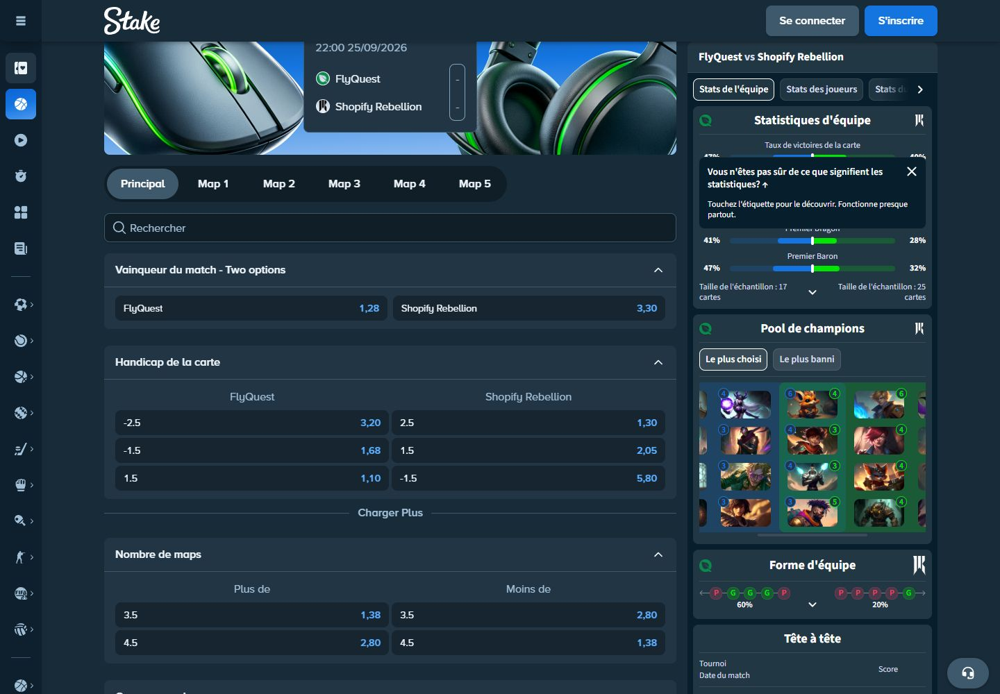
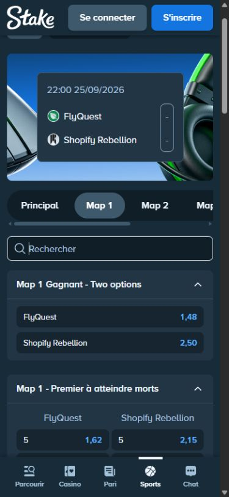

# Audit Stake.bet — esport, League of Legends, DOM et marchés

**Observation : 22 septembre 2026, heure de Paris. Statut : audit partiel documenté, interrompu par une limitation d’accès du site.**

L’audit a relevé le calendrier LoL publié, sept fiches de rencontre et leurs marchés accessibles. Il fournit une cartographie du DOM, des mesures de disposition, des cotes datées, les lignes/seuils (« cuts »), les états de suspension et les preuves de navigation. Il **ne certifie pas l’exhaustivité de Stake**, des compétitions, des marchés futurs ou des états live.

Le scraper existant a été essayé : Patchright/Chromium dans l’image worker reçoit un **HTTP 403** sur la page esport. Le navigateur Codex, accessible séparément, a permis les observations suivantes avant de recevoir **Error 1015 — You are being rate limited**. Aucun accès supplémentaire à Stake n’a été effectué après ce second blocage. Les dix autres fiches LoL et les détails des autres jeux restent à vérifier.

## 1. Livrables et chiffres contrôlés

| Livrable / mesure                           | Résultat                                                          |
| ------------------------------------------- | ----------------------------------------------------------------- |
| Calendrier LoL                              | 17 rencontres listées après « Charger Plus »                      |
| Fiches LoL effectivement inspectées         | 7 sur ces 17                                                      |
| Familles de marchés distinctes              | 16, en regroupant uniquement les numéros de carte                 |
| Sélections distinctes dans le corpus retenu | 204                                                               |
| Sélections avec une cote numérique          | 174                                                               |
| Sélections explicitement désactivées        | 30, sur Pyramid–LODIS                                             |
| Captures navigateur                         | 33 ensembles DOM / arbre accessible / PNG                         |
| Scraper worker                              | 1 diagnostic de refus, distinct des 33 captures navigateur        |
| Formats inspectés                           | 1440 × 1000, 390 × 844, 768 × 1024 ; entrée initiale à 732 × 912  |
| Écritures dans Metiquo                      | Documentation seulement ; aucune cote importée dans l’application |

Les 204 lignes dédupliquent les vainqueurs de carte présents à la fois dans « Principal » et dans « Map N ». Elles ne comptent pas le bouton du curseur de score lorsqu’aucun score coté n’est choisi. Ce sont des sélections DOM distinguées par contexte, **pas 204 identifiants de sélection fournis par Stake**.

- [Index des preuves, captures et empreintes](audits/stake/2026-09-22/README.md).
- [Atlas DOM, sélecteurs et mesures](audits/stake/2026-09-22/dom-and-layout.md).
- [Annexe intégrale des sélections et cotes](audits/stake/2026-09-22/markets-and-quotes.md).
- [Cotes en CSV](audits/stake/2026-09-22/quotes.csv), [observations de marchés en JSON](audits/stake/2026-09-22/market-observations.json), [inventaire des rencontres](audits/stake/2026-09-22/events.json).
- [Manifeste des captures](audits/stake/2026-09-22/manifest.json) et [empreintes de tous les fichiers du dossier](audits/stake/2026-09-22/checksums.json).

## 2. Périmètre, méthode et valeur des preuves

La demande du 22 septembre autorise cet audit ponctuel et fait explicitement évoluer la restriction antérieure d’accès à Stake dans `AGENTS.md`. Le module `StakeSource` reste un emplacement désactivé qui lève `NotImplementedError`. Le worker permanent, les planifications, PostgreSQL, les contrats API et les fixtures ne sont pas modifiés.

La navigation est anonyme : entrée sur `https://stake.bet`, redirection observée vers `/fr`, ouverture de Sports, puis du lien esport et du filtre LoL. Les fiches sont découvertes dans les liens rendus du calendrier. Aucun compte, code de connexion, mise, paiement ou sélection dans le bulletin de pari n’est utilisé. La bannière de cookies a été acceptée pour dégager la lecture ; son état initial est conservé dans les premières captures.

### 2.1 Trois niveaux à ne pas confondre

| Niveau                 | Ce qu’il établit                                          | Ce qu’il n’établit pas                                      |
| ---------------------- | --------------------------------------------------------- | ----------------------------------------------------------- |
| DOM et captures datés  | Texte et géométrie rendus dans cette session              | Actualité du flux sous-jacent, disponibilité future         |
| Libellé ou URL observé | Identité affichée, chemin, numéro inclus dans le slug     | Identifiant API contractuel, classification sportive exacte |
| Interprétation d’audit | Proposition de séparation des champs et pièges de parsing | Règle officielle de règlement ou comportement non testé     |

Les dates `observedAt` sont les dates de lecture du DOM. Elles ne sont pas des dates de publication des cotes par Stake. Les lectures DOM, AX et PNG se suivent : un changement peut survenir entre elles. Les pourcentages et scores du widget de statistiques ne sont pas des probabilités Metiquo.

### 2.2 Outillage existant effectivement utilisé

L’image locale `metiquo-worker:local` contient **Patchright 1.62.3** et **Chromium 151.0.7922.34**. Un conteneur temporaire séparé a lancé ce navigateur en profil anonyme éphémère, `fr-FR`, `Europe/Paris`, 1440 × 1000. Il n’a reçu ni connexion PostgreSQL ni secret applicatif. Le point d’entrée existant `apps/worker/src/metiquo_worker/sources/stake.py` n’a pas été activé.

À **22:02:46.325 UTC le 21 septembre**, le document `/fr/sports/esports` répond 403 ; le titre rendu est « Un instant… ». Le diagnostic compte 11 requêtes de chargement du navigateur et 10 réponses observées, puis s’arrête sans autre navigation. Aucun `Retry-After` n’est présent dans les en-têtes relevés de ce refus. [Métadonnées](audits/stake/2026-09-22/001-worker-403.meta.json), [journal réseau sans cookies ni paramètres d’URL](audits/stake/2026-09-22/001-worker-network.json).

Le navigateur Codex fonctionnait déjà sur le site : ses relevés DOM constituent une voie d’observation distincte. L’audit n’a pas transféré ses cookies au worker, modifié l’identité réseau, résolu de challenge ni essayé de miroir du site.

À **22:10:40 UTC**, l’ouverture de quante–humzh aboutit à la page Cloudflare 1015. La preuve est enregistrée à 22:11:10.872 UTC. Le site indique une interdiction temporaire, sans durée exploitable dans le texte visible. Le statut HTTP de cette seconde réponse n’a pas été mesuré ; **1015 est le code affiché, pas un statut HTTP 1015**. Aucun délai de reprise n’est inventé. [Capture du blocage](audits/stake/2026-09-22/027-rate-limit-1015.png).

### 2.3 Qualité de l’archive

Chaque capture conserve des nœuds avec parent, balise, attributs retenus, texte direct, rectangle et propriétés CSS calculées. Les scripts et styles ne sont pas archivés avec leur contenu ; leurs références publiques sont listées lorsqu’exposées. Aucun stockage de session ou cookie n’est exporté. Les paramètres et fragments des URLs sont retirés dans les JSON DOM ; les arbres accessibles gardent les liens de navigation rendus.

Les captures 002 et 003 ont été tronquées à 2000 nœuds par le transfert de résultat. Ce défaut a été détecté et corrigé : dès 004, export par blocs de 500 et vérification du nombre reçu. Les premières captures ne servent donc pas à affirmer une couverture DOM complète. Le calendrier complet est fondé sur 004.

Les documents enfant des iframes ne sont pas inclus dans l’inventaire géométrique du document parent. Leur texte accessible apparaît dans les AX lorsqu’il était chargé. Les paragraphes éditoriaux longs, sans rapport avec l’inventaire, sont omis avec un marqueur ; les nœuds et leurs mesures restent présents. Les PNG sont conservés sans retouche.

## 3. Navigation et catégories esport

### 3.1 Chemins observés

| Surface               | Chemin observé                                                    | Vérification                                  |
| --------------------- | ----------------------------------------------------------------- | --------------------------------------------- |
| Accueil français      | `/fr`                                                             | Ouvert                                        |
| Accueil Sports        | `/fr/sports/home`                                                 | Ouvert ; lien vers esport lu                  |
| Hub esport            | `/fr/sports/esports`                                              | Ouvert ; preuve 002                           |
| Hub esport filtré LoL | `/fr/sports/esports/league-of-legends`                            | Ouvert ; preuves 003–004                      |
| Racine sportive LoL   | `/fr/sports/league-of-legends`                                    | Liens observés ; page non auditée             |
| Catégorie source      | `/fr/sports/league-of-legends/international-1`                    | Fil d’Ariane observé ; page non auditée       |
| Compétition           | `/fr/sports/league-of-legends/international-1/<slug-compétition>` | Liens observés                                |
| Rencontre             | Même chemin suivi de `<nombre>-<slug-rencontre>`                  | Sept fiches ouvertes                          |
| Règles sportives      | `/fr/policies/sportsbook`                                         | Lien du footer observé ; contenu non consulté |

Sources : [hub esport](https://stake.bet/fr/sports/esports), [filtre LoL](https://stake.bet/fr/sports/esports/league-of-legends). Les slugs `international-1` et les suffixes `t4`, `t8`, `t9`, `t10` sont conservés comme texte source : aucune région réelle, division ou échelle de niveau n’en est déduite.

### 3.2 Inventaire du menu esport au moment du relevé

| Libellé           | Slug du filtre           | Compteur affiché |
| ----------------- | ------------------------ | ---------------: |
| Tout              | racine esport            |              157 |
| CS2               | `counter-strike`         |               42 |
| Dota 2            | `dota-2`                 |                6 |
| CS2 Duels         | `counter-strike-2-duels` |                2 |
| eCricket          | `ecricket`               |                2 |
| FIFA              | `fifa`                   |               10 |
| League of Legends | `league-of-legends`      |               17 |
| NBA2K             | `nba2k`                  |                4 |
| Rainbow Six       | `rainbow-six`            |               22 |
| Valorant          | `valorant`               |                8 |
| Starcraft 1       | `starcraft-1`            |                3 |
| Crossfire         | `crossfire`              |                6 |
| FIFA Bots         | `efootball-bots`         |               32 |
| Madden            | `etouchdown`             |                3 |

La somme de ces treize compteurs vaut 157 dans ce relevé. Cela ne prouve ni la liste universelle des jeux de Stake, ni un filtre stable dans le temps. Les simulations comme FIFA Bots sont affichées dans cette même navigation et doivent rester identifiables séparément des compétitions LoL.

Le hub présente « En Direct & À Venir ». À 1440 px, les contrôles « Affichage / Standard » et « Marché / Vainqueur » sont rendus. Leurs menus n’ont pas été ouverts : aucune autre option n’est affirmée. Les liens de jeu sont distincts du sélecteur de marché.

### 3.3 Pagination et décompte

Le premier lot LoL contient 10 rencontres alors que le compteur annonce 17. Un clic sur « Charger Plus » ajoute les sept suivantes ; le contrôle de pagination du calendrier disparaît ensuite. Un autre « Charger Plus » appartient aux jeux casino plus bas dans la page : il ne faut pas l’utiliser pour paginer les rencontres.

Le symbole `+N` près d’une rencontre doit rester un **compteur brut observé**. CFO–KT affiche `+1` et sa fiche ne montre qu’un marché vainqueur. Il serait donc incorrect de le traduire automatiquement par « N marchés supplémentaires en plus du vainqueur ». La définition exacte de ce compteur n’a pas été vérifiée dans un contrat source.

## 4. Inventaire des 17 rencontres LoL

Relevé de la liste : **00:05:40.900 Paris, le 22 septembre**. Les horaires de rencontre ci-dessous sont ceux affichés dans l’interface ; leur fuseau n’est pas explicitement publié dans les éléments inspectés. Ils ne sont pas convertis arbitrairement en UTC.

| ID dans l’URL | Rencontre                             | Date / heure affichée | Compétition                          | Cotes du vainqueur, ordre des noms | `+N` | Fiche             |
| ------------- | ------------------------------------- | --------------------- | ------------------------------------ | ---------------------------------- | ---: | ----------------- |
| 845075        | Pyramid IV Esports – LODIS            | En Direct, 1re Map    | EMEA Masters 2026 Summer LCQ         | Suspendu / Suspendu                |   16 | auditée           |
| 845065        | CFO Academy – KT Rolster Challengers  | 22/09, 09:00          | World Star Challengers Invitational  | 7,00 / 1,06                        |    1 | auditée           |
| 845066        | Fuego – T1 Esports Academy            | 22/09, 10:00          | World Star Challengers Invitational  | 7,50 / 1,05                        |    1 | auditée           |
| 845067        | Movistar KOI Academy – CFO Academy    | 22/09, 13:00          | World Star Challengers Invitational  | 1,38 / 2,80                        |    1 | auditée           |
| 845068        | Fuego – DN SOOPers Challengers        | 22/09, 15:00          | World Star Challengers Invitational  | 7,00 / 1,06                        |    1 | auditée           |
| 844333        | Pobelter – chenchen53                 | 22/09, 18:00          | Tyler1 All Stars Season 2026 Week 14 | 1,35 / 2,90                        |    8 | auditée           |
| 843526        | quante – humzh                        | 22/09, 18:30          | Tyler1 All Stars Season 2026 Week 14 | 2,40 / 1,50                        |    8 | ouverture bloquée |
| 843527        | Geranimo – TFBlade                    | 22/09, 19:00          | Tyler1 All Stars Season 2026 Week 14 | 7,00 / 1,06                        |    8 | liste seulement   |
| 843528        | JbearLOL – Lourlo                     | 22/09, 19:30          | Tyler1 All Stars Season 2026 Week 14 | 2,20 / 1,58                        |    8 | liste seulement   |
| 845833        | FlyQuest – Shopify Rebellion          | 25/09, 22:00          | LCS 2026 Summer Playoffs             | 1,28 / 3,30                        |   60 | auditée           |
| 845961        | FURIA Esports – RED Canids            | 26/09, 18:00          | CBLOL 2026 Split 2 Playoffs          | 1,13 / 5,00                        |   60 | liste seulement   |
| 836114        | LOUD – LOS                            | 27/09, 18:00          | CBLOL 2026 Split 2 Playoffs          | 2,00 / 1,72                        |   60 | liste seulement   |
| 845836        | Cloud9 – Team Liquid                  | 27/09, 22:00          | LCS 2026 Summer Playoffs             | 2,50 / 1,48                        |   60 | liste seulement   |
| 842405        | KaBuM! Ilha das Lendas – Golden Lions | 28/09, 23:00          | CBLOL 2027 Promotion                 | Suspendu / Suspendu                |    6 | liste seulement   |
| 842149        | Estral Esports – 9z Team              | 29/09, 23:00          | CBLOL 2027 Promotion                 | 1,01 / 11,00                       |    6 | liste seulement   |
| 842137        | Maryville University – Zeu5 Esports   | 05/10, 22:00          | LCS 2027 Promotion                   | 1,02 / 10,00                       |    6 | liste seulement   |
| 842135        | Cupid Esports – Fuego                 | 06/10, 22:00          | LCS 2027 Promotion                   | 1,10 / 5,80                        |    6 | liste seulement   |

Les cotes de cette table viennent de la **liste**, y compris pour les dix fiches non inspectées. Les 204 lignes de l’annexe chiffrent les **sept fiches**, sans mélanger ces deux populations. Les URLs exactes et les blocs texte de la liste figurent dans [events.json](audits/stake/2026-09-22/events.json).

Les noms ne sont pas uniformes : la même rencontre peut utiliser « Movistar KOI Academy », « KOI Academy » et « Movistar KOI.A ». Le texte visible « chenchen5 » coexiste avec le nom accessible et le lien « chenchen53 ». Une égalité de chaîne affichée ne suffit donc pas à relier une équipe ; à l’inverse, il ne faut pas supprimer « Academy » ou « Challengers » lors d’un rapprochement.

## 5. Structure visuelle et positionnement

La page de liste est une suite verticale de rencontres. Chaque bloc associe un lien d’événement, jeu, état/horaire, compétition, deux concurrents, scores éventuels, marché principal, boutons de cote et compteur `+N`. La zone de rencontre précède les jeux casino, le flux public de paris et le footer. Ce flux inférieur contient lui aussi des nombres de cotes : un parseur global du texte ou des nombres mélangerait des données sans rapport.

La fiche desktop ajoute un fil d’Ariane, un résumé de rencontre illustré, les boutons « Principal / Map N », un champ « Rechercher » et des accordéons de marchés. Un widget de statistiques occupe la colonne de droite sur FlyQuest–Shopify. Le bulletin de pari existe dans l’arbre accessible, même quand sa géométrie ne le rend pas visible.

Mesures de la capture 005, sidebar compacte : largeur totale 1440 px ; sidebar 60 px ; en-tête de 60 px ; région de contenu de 1200 px à x=150 ; colonne de marchés 824 px ; espace de 16 px ; widget droit 360 px. Un bouton de cote du marché vainqueur mesure 392 × 36 px. Ces mesures décrivent cet état, pas des constantes garanties du site.

À 390 px, le résumé puis les marchés sont empilés et la navigation inférieure « Parcourir / Casino / Pari / Sports / Chat » est visible. Les boutons vainqueur occupent chacun leur ligne, alors que le tableau « Premier à atteindre » conserve deux colonnes. Les onglets de carte défilent horizontalement. Le widget droit n’est pas monté dans le document parent de ce relevé mobile.

La capture tablette à 768 × 1024 conserve des vainqueurs sur deux colonnes et une zone de marchés d’environ 662 px. Elle a été prise juste après redimensionnement : la sidebar présente une position intermédiaire. Elle documente la géométrie capturée, sans valider un breakpoint stable. L’[atlas DOM](audits/stake/2026-09-22/dom-and-layout.md) détaille les coordonnées, les états et les limites.

## 6. Taxonomie des marchés LoL effectivement observés

Le terme « cut » est utilisé ici pour une **ligne ou un seuil de marché** : handicap, total, course à N, Nième événement ou durée. Il ne désigne pas une mise, une limite de compte ou une fonction de cash-out.

| Famille            | Libellé source                    | Dimension / sélections                     | Présence prouvée                                     |
| ------------------ | --------------------------------- | ------------------------------------------ | ---------------------------------------------------- |
| Vainqueur de série | Vainqueur du match - Two options  | Deux concurrents                           | FlyQuest, Pobelter, quatre WSCI                      |
| Handicap de cartes | Handicap de la carte              | Handicap signé attaché à chaque concurrent | FlyQuest, Pobelter                                   |
| Total de cartes    | Nombre de maps                    | Plus / Moins d’un seuil                    | FlyQuest, Pobelter, Pyramid suspendu                 |
| Au moins une carte | Gagne au moins un map             | Oui / Non, pour une équipe donnée          | FlyQuest, Pobelter, Pyramid suspendu                 |
| Score exact        | Résultat final                    | Couples de scores, curseur ou vue Tout     | FlyQuest, Pobelter ; état vide/suspendu sur Pyramid  |
| Vainqueur de carte | Map N Gagnant - Two options       | Deux concurrents, numéro de carte requis   | FlyQuest 1–5, Pobelter 1–3                           |
| Course à N kills   | Map N - Premier à atteindre morts | Équipe × seuil 5, 10 ou 15                 | FlyQuest 1–5 ; labels accessibles « N Kills »        |
| Premier sang       | Map N - Premier sang              | Deux concurrents                           | FlyQuest 1–5                                         |
| Premier Baron      | Map N - Premier Baron             | Deux concurrents                           | FlyQuest 1–5                                         |
| Premier inhibiteur | Map N - Premier inhibiteur        | Deux concurrents                           | FlyQuest 1–5                                         |
| Nième kill         | Map N - º meurtre                 | Équipe × rang 10, 20 ou 30                 | FlyQuest 1–5 ; labels « Nth Kill »                   |
| Quadruple kill     | Map N - Quadruple meurtre         | Une sélection Yes publiée                  | FlyQuest 1–5                                         |
| Quintuple kill     | Map N - Quintuple meurtre         | Une sélection Yes publiée                  | FlyQuest 1–5                                         |
| Parité             | Map N - Victoires paires/impaires | Odd / Even                                 | FlyQuest 1–5 ; objet réglé à confirmer               |
| Total de kills     | Map N - Nombre total de tués      | Plus / Moins de 25.5, 26.5, 27.5           | Pyramid cartes 2 et 3, suspendu                      |
| Durée              | Map N - Durée de                  | Plus / Moins de 26, 27, 28                 | Pyramid cartes 2 et 3, suspendu ; unité non affichée |

La terminologie française est parfois incomplète ou mélangée à l’anglais. « Premier à atteindre morts » n’est pas normalisé en statistiques de décès : les noms accessibles font référence à `Kills`. « Victoires paires/impaires » ne permet pas, à lui seul, d’affirmer ce qui est compté au règlement. L’unité des seuils de durée n’est pas écrite dans les boutons audités : elle demeure inconnue dans l’export.

L’absence d’une sélection « No » pour les quadruples/quintuples ne permet pas de la créer par complément. Les marchés de première tour, premier dragon, handicap de kills, joueurs, vainqueur de tournoi et combiné LoL n’ont pas été vus dans les sept fiches. Ce constat ne signifie pas qu’ils n’existent jamais sur Stake.

## 7. Cotes et lignes — FlyQuest contre Shopify Rebellion

Source : [fiche 845833](https://stake.bet/fr/sports/league-of-legends/international-1/lcs-2026-summer-playoffs-t4/845833-flyquest-shopify-rebellion). Principal développé à **22:06:31.230 UTC** ; cartes lues entre **22:07:04.051 et 22:07:07.468 UTC**. Les chiffres sont historiques dès leur enregistrement.

### 7.1 Marchés de série

| Marché / ligne                    | FlyQuest / première option | Shopify / seconde option |
| --------------------------------- | -------------------------- | ------------------------ |
| Vainqueur                         | FlyQuest 1,28              | Shopify 3,30             |
| Handicap −2.5 / +2.5              | FlyQuest −2.5 : 3,20       | Shopify +2.5 : 1,30      |
| Handicap −1.5 / +1.5              | FlyQuest −1.5 : 1,68       | Shopify +1.5 : 2,05      |
| Handicap +1.5 / −1.5              | FlyQuest +1.5 : 1,10       | Shopify −1.5 : 5,80      |
| Handicap +2.5 / −2.5              | FlyQuest +2.5 : 1,02       | Shopify −2.5 : 10,00     |
| Total 3.5 cartes                  | Plus : 1,38                | Moins : 2,80             |
| Total 4.5 cartes                  | Plus : 2,80                | Moins : 1,38             |
| Shopify gagne au moins une carte  | Oui : 1,30                 | Non : 3,20               |
| FlyQuest gagne au moins une carte | Oui : 1,02                 | Non : 10,00              |

La quatrième ligne de handicap n’est présente qu’après « Charger Plus ». Dans l’état initial, trois lignes sont visibles. La source utilise un point pour les seuils (`3.5`) et une virgule pour les cotes (`1,38`) sur la même page française.

### 7.2 Scores exacts révélés par « Tout »

| Score FlyQuest : Shopify |  Cote |
| ------------------------ | ----: |
| 0:3                      | 10,00 |
| 1:3                      |  7,50 |
| 3:1                      |  3,10 |
| 3:0                      |  3,20 |
| 2:3                      |  5,80 |
| 3:2                      |  4,40 |

Cet ordre est celui du DOM observé ; il n’est ni lexicographique ni organisé uniquement par équipe gagnante. Les scores proposés atteignent trois victoires et la navigation comporte cinq cartes, mais aucun champ explicite `bestOf` n’a été extrait. Les marchés seuls ne doivent pas remplacer une preuve indépendante du format de série.

### 7.3 Vainqueur et objectifs par carte

Dans les cellules à deux valeurs, l’ordre est **FlyQuest / Shopify**. Les cartes 1, 2 et 3 ont été visitées séparément ; leurs valeurs sont identiques dans ces trois relevés.

| Marché / seuil                    | Cartes 1, 2 et 3 | Carte 4     | Carte 5     |
| --------------------------------- | ---------------- | ----------- | ----------- |
| Vainqueur                         | 1,48 / 2,50      | 1,50 / 2,40 | 1,55 / 2,30 |
| Premier à 5 kills                 | 1,62 / 2,15      | 1,62 / 2,15 | 1,65 / 2,10 |
| Premier à 10 kills                | 1,52 / 2,35      | 1,52 / 2,35 | 1,62 / 2,15 |
| Premier à 15 kills                | 1,50 / 2,40      | 1,50 / 2,40 | 1,58 / 2,20 |
| Premier sang                      | 1,78 / 1,92      | 1,78 / 1,92 | 1,78 / 1,92 |
| Premier Baron                     | 1,52 / 2,35      | 1,55 / 2,30 | 1,62 / 2,15 |
| Premier inhibiteur                | 1,48 / 2,50      | 1,50 / 2,40 | 1,55 / 2,30 |
| 10e kill                          | 1,72 / 2,00      | 1,72 / 2,00 | 1,78 / 1,92 |
| 20e kill                          | 1,68 / 2,05      | 1,68 / 2,05 | 1,72 / 2,00 |
| 30e kill                          | 1,65 / 2,10      | 1,65 / 2,10 | 1,72 / 2,00 |
| Quadruple meurtre — Yes seulement | 6,30             | 6,30        | 6,30        |
| Quintuple meurtre — Yes seulement | 11,00            | 11,00       | 11,00       |
| Odd / Even                        | 1,85 / 1,85      | 1,85 / 1,85 | 1,85 / 1,85 |

Il est essentiel de distinguer « premier à atteindre 10 kills » et « auteur du 10e kill » : même nombre, deux intitulés et deux couples de cotes différents. Le numéro de carte est également indispensable : la cinquième carte a des prix différents pour plusieurs de ces marchés.

## 8. Marchés All Stars et Challengers

### 8.1 Pobelter – chenchen53

Source : [fiche 844333](https://stake.bet/fr/sports/league-of-legends/international-1/tyler1-all-stars-season-2026-week-14-t9/844333-pobelter-chenchen53). Vue de série développée à **22:10:15.022 UTC** ; cartes 1–3 inspectées auparavant. La même ambiguïté d’identité visible « chenchen5 » est conservée dans les preuves.

| Marché                     | Première sélection   | Seconde sélection      |
| -------------------------- | -------------------- | ---------------------- |
| Vainqueur                  | Pobelter 1,35        | chenchen53 2,90        |
| Handicap                   | Pobelter −1.5 : 2,10 | chenchen53 +1.5 : 1,65 |
| Handicap                   | Pobelter +1.5 : 1,10 | chenchen53 −1.5 : 5,80 |
| Total 2.5 cartes           | Plus 2,10            | Moins 1,65             |
| chenchen53 gagne une carte | Oui 1,65             | Non 2,10               |
| Pobelter gagne une carte   | Oui 1,10             | Non 5,80               |
| Vainqueur carte 1          | Pobelter 1,48        | chenchen53 2,50        |
| Vainqueur carte 2          | Pobelter 1,48        | chenchen53 2,50        |
| Vainqueur carte 3          | Pobelter 1,52        | chenchen53 2,35        |

Scores exacts : **2:0 → 2,10 ; 1:2 → 4,80 ; 2:1 → 3,20 ; 0:2 → 5,80**. Les trois onglets de carte ne montrent que leur marché vainqueur, contrairement à FlyQuest–Shopify qui propose neuf familles par carte. Le compteur `+8` de la liste ne permet pas de deviner les familles ou le nombre de sélections.

### 8.2 Quatre rencontres WSCI

Chacune des quatre fiches ouvertes expose un onglet Principal et un seul marché à deux issues :

| Rencontre                            | Première issue | Seconde issue |
| ------------------------------------ | -------------- | ------------- |
| CFO Academy – KT Rolster Challengers | 7,00           | 1,06          |
| Fuego – T1 Esports Academy           | 7,50           | 1,05          |
| Movistar KOI Academy – CFO Academy   | 1,38           | 2,80          |
| Fuego – DN SOOPers Challengers       | 7,00           | 1,06          |

L’absence d’onglets de carte ne constitue pas une preuve de BO1. Aucune famille de marché supplémentaire n’est déduite des autres compétitions. Preuves 021 à 024 et leurs reprises après chargement.

## 9. Live, suspension et « cuts » non cotés

Source : [Pyramid IV Esports–LODIS, 845075](https://stake.bet/fr/sports/league-of-legends/international-1/emea-masters-2026-summer-lcq-t10/845075-pyramid-iv-esports-lodis). La liste indique « En Direct », « 1re Map », score de série 0–0 et nombres 13–29 pour la première carte. Il s’agit de **l’état affiché par Stake**, sans horodatage source prouvant sa fraîcheur et sans certification du résultat esport réel.

La fiche présente un contrôle Tableau des scores / Transmission en direct et une invitation à se connecter pour voir le stream. Aucun stream ni compte n’est ouvert. Les onglets disponibles sont Principal, Map 2 et Map 3 ; Map 1 n’est pas proposée dans la navigation des marchés inspectée.

| Région                            | Lignes publiées                     | État                      |
| --------------------------------- | ----------------------------------- | ------------------------- |
| Principal — Nombre de maps        | Plus / Moins de 2.5                 | 2 boutons désactivés      |
| Principal — Gagne au moins un map | LODIS Oui / Non ; Pyramid Oui / Non | 4 boutons désactivés      |
| Principal — Résultat final        | Curseur sans cote ; vue Tout vide   | Pas de score coté extrait |
| Map 2 — Nombre total de tués      | Plus / Moins de 25.5, 26.5, 27.5    | 6 boutons désactivés      |
| Map 2 — Durée de                  | Plus / Moins de 26, 27, 28          | 6 boutons désactivés      |
| Map 3 — Nombre total de tués      | Plus / Moins de 25.5, 26.5, 27.5    | 6 boutons désactivés      |
| Map 3 — Durée de                  | Plus / Moins de 26, 27, 28          | 6 boutons désactivés      |

La ligne a une existence observable même quand sa cote est absente. Dans ces cas, `[data-testid="fixture-odds"]` peut ne pas exister et le bouton porte `disabled`. Il faut enregistrer `odds = null` avec l’état publié, et conserver le dernier prix antérieur uniquement comme historique daté. Une absence de prix n’est ni une cote nulle, ni 1,00, ni une suppression certaine du marché.

Le nom accessible peut également manquer sur un bouton suspendu. Les deux boutons `25.5` deviennent indiscernables si on jette les en-têtes « Plus de / Moins de ». La position dans la grille et l’en-tête de colonne doivent être conservés avec la preuve, sans faire de la seule position une identité permanente.

## 10. Interactions et états vérifiés

| Parcours / état              | Observation                                                             | Preuve           |
| ---------------------------- | ----------------------------------------------------------------------- | ---------------- |
| Pagination de rencontres     | 10 puis 17 rencontres                                                   | 003–004          |
| Changement Principal / Map N | Contenus et catégories différents ; doublons de vainqueur à dédupliquer | 005–011, 025     |
| Déploiement de handicap      | Une quatrième ligne de handicap apparaît                                | 005–006          |
| Score exact Slider / Tout    | Un contrôle de score sans cote devient six ou quatre issues cotées      | 005–006, 025–026 |
| Recherche `Baron` dans Map 1 | Un seul groupe, Premier Baron, reste dans les marchés                   | 012              |
| Recherche sans résultat      | « Aucun Marchés Disponible. » ; le reste de la page reste présent       | 013–014          |
| Effacement de recherche      | Les neuf familles de Map 1 réapparaissent                               | 015              |
| Passage mobile               | Vainqueurs empilés ; tableau à seuils toujours à deux colonnes          | 015              |
| Marché suspendu              | Libellé Suspendu, bouton disabled, cote absente                         | 017–020          |
| Source bloquée               | Page d’erreur remplace les marchés                                      | 027              |

La recherche est vérifiée sur un onglet précis. Sa portée globale sur tous les onglets, sa normalisation des accents et ses délais ne sont pas certifiés. L’URL peut changer avant que le nouveau panneau soit prêt : une capture doit vérifier le contenu du panneau, pas uniquement l’adresse. Des états transitoires de chargement ont été rencontrés.

La navigation des cartes n’est pas démontrée fixe au défilement. Le DOM inspecté montre notamment `.groups` en `position: relative` et une rangée horizontale ; aucun audit de tous les états de défilement n’a été mené. L’observation ne permet pas non plus de quantifier les animations de hausse/baisse de cote ou la latence d’actualisation live.

## 11. Widget de statistiques et dépendances visibles

La fiche FlyQuest incorpore un iframe `widget-od-90225` dont l’hôte observé est **`disir.oddin.gg`**, chemin `/lol/match`. L’arbre accessible montre des commandes pour les statistiques d’équipe, de joueurs et de tournoi. Le panneau initial contient taux de victoire de carte, premiers objectifs, tailles d’échantillon, pool de champions, forme récente et face-à-face. Les autres onglets du widget n’ont pas été ouverts.

Le numéro `90225` dans l’ID de widget diffère du numéro `845833` de l’URL Stake. Ce sont deux espaces d’identifiants distincts ; leur présence sur la même fiche fournit une association observée, pas un contrat général de conversion. Le widget ne prouve pas à lui seul la provenance des cotes du sportsbook.

L’inventaire parent conserve les URLs publiques de scripts, feuilles CSS, images et iframes déjà montés. Il ne contient **pas de HAR complet du navigateur**, ni l’analyse des réponses GraphQL/WebSocket, ni des identifiants de marché extraits d’un état JavaScript interne. Aucun endpoint privé, jeton ou requête rejouée n’est utilisé. Les en-têtes/cookies et les paramètres d’URL ne font pas partie de la documentation livrée.

Le DOM comporte également Intercom et des iframes de mesure publicitaire. Ils ne sont ni des fournisseurs de cotes ni des régions à parcourir pour extraire les marchés.

## 12. Contrat de lecture proposé à partir de l’audit

Ce contrat est une **recommandation documentaire**, non une intégration active. La preuve actuelle reste le DOM et ses URLs.

| Champ                                 | Origine requise / traitement                                                  |
| ------------------------------------- | ----------------------------------------------------------------------------- |
| `source`                              | `stake.bet`, sans remplacer la provenance par celle du widget                 |
| `sourceEventRef`                      | Numéro observé dans le slug + URL exacte ; ne pas promettre sa pérennité      |
| `sourceCompetitionPath`               | Segment de compétition tel que publié                                         |
| `sourceMarketId`, `sourceSelectionId` | Inconnus dans cet audit ; ne pas remplir avec un index DOM                    |
| `scope`                               | Série ou carte, déterminé par le groupe et l’onglet                           |
| `mapNumber`                           | Numéro publié ; jamais déduit de l’ordre du bouton                            |
| `marketLabelRaw`                      | Libellé complet original, y compris traductions imparfaites                   |
| `selectionLabelRaw`                   | Nom accessible et texte visible conservés séparément                          |
| `competitorRef`                       | Identité source si établie ; sinon nom et position accompagnés de leur preuve |
| `lineRaw` / `lineValue`               | Chaîne source et nombre décimal signé ; jamais extrait de la cote             |
| `lineUnit`                            | Cartes/kills/rang quand établi ; `null` pour la durée sans unité vérifiée     |
| `direction`                           | Over/Under, Oui/Non, Odd/Even ou équipe, avec contexte de colonne             |
| `oddsRaw` / `decimalOdds`             | Texte français original et décimal normalisé ; `null` si absent               |
| `availability`                        | Coté, désactivé, absent de la vue, état vide ou source indisponible séparés   |
| `observedAt`                          | Horloge du relevé UTC                                                         |
| `sourceUpdatedAt`                     | Inconnu faute d’horodatage publié de la cote                                  |
| `evidenceRef`                         | Capture + numéro de nœud local + empreinte                                    |

Une clé interne provisoire doit au minimum distinguer rencontre, famille, portée, numéro de carte, équipe, seuil signé et direction. Le texte brut reste nécessaire lorsque la normalisation est ambiguë. L’identité ne doit pas dépendre de `nth-child`, des classes `svelte-*`, des cotes ou du nom abrégé d’une équipe.

### Exigences avant toute collecte permanente future

1. Obtenir un accès source admissible et vérifier son fonctionnement dans l’environnement worker ; l’accès navigateur actuel ne le prouve pas.
2. Définir un budget partagé de requêtes et de sous-ressources, un arrêt sur refus et une temporisation persistée. La présente session n’établit **aucun débit sûr** : les accès rapprochés ont fini sur un blocage.
3. Découvrir les liens et onglets réellement présents, paginer seulement dans leur région et vérifier le contenu après navigation.
4. Séparer document parent, widget de statistiques, historique public de paris et bulletin utilisateur.
5. Enregistrer les suspensions comme observations explicites ; conserver l’historique de cotes sans transformer une relecture en nouvelle mise à jour source.
6. Vérifier les règles de règlement de chaque famille, notamment durée, parité, interruption de carte, report, remake et résultat exact, avant une normalisation opérationnelle.
7. Tester les états manquants et les correspondances d’équipes Academy/Challengers sur un échantillon supplémentaire réellement consultable.

## 13. Pièges démontrés et priorités

| Priorité d’audit          | Piège                                                   | Conséquence concrète                                                          |
| ------------------------- | ------------------------------------------------------- | ----------------------------------------------------------------------------- |
| Bloquante pour un scraper | 403 worker et 1015 navigateur                           | Aucun collecteur fiable n’est validé                                          |
| Haute                     | Lire seulement le premier lot                           | 7 des 17 rencontres manquent                                                  |
| Haute                     | Lire seulement Principal                                | Objectifs et seuils propres aux cartes manquent                               |
| Haute                     | Ignorer « Charger Plus »                                | Handicap +2.5/−2.5 absent du relevé initial                                   |
| Haute                     | Confondre curseur sans cote et marché suspendu          | Le score exact actif devient faussement indisponible                          |
| Haute                     | Extraire tous les nombres de la page                    | Cotes du flux public de paris et statistiques mélangées                       |
| Haute                     | Perdre la colonne d’une sélection suspendue             | Plus et Moins ont le même texte `25.5`                                        |
| Haute                     | Fusionner course à 10 et 10e kill                       | Deux marchés différents deviennent une seule série                            |
| Haute                     | Réutiliser les abréviations comme IDs                   | Risque de confusion de concurrents et d’académies                             |
| Haute                     | Affirmer qu’En Direct signifie récent                   | Aucune fraîcheur du flux source n’est démontrée                               |
| Moyenne                   | Prendre `+N` pour des marchés supplémentaires           | Compteur mal interprété dès CFO–KT                                            |
| Moyenne                   | Imposer une liste fixe de familles                      | WSCI, All Stars, playoffs et live ont des offres différentes                  |
| Moyenne                   | Supposer que `rendered=true` signifie visible à l’écran | Des nœuds ont des rectangles hors viewport ; le bulletin peut être hors écran |
| Moyenne                   | Réutiliser une classe générée comme contrat             | Sélecteur fragile après build ou variante responsive                          |

## 14. Couverture restante, sans résultat inventé

L’audit n’a pas pu terminer l’inspection des dix autres fiches du calendrier. Il ne couvre pas les détails CS2, Dota 2, Valorant et autres jeux, les pages de compétition ouvertes séparément, les tournois gagnants, les formats de cotes alternatifs, les règles de règlement, les marchés joueurs, les états cash-out et les offres réservées à une session authentifiée.

Les variantes de thème, les parcours clavier complets, un audit WCAG, les points de rupture stabilisés, les survols, les changements de cote en direct, les allers-retours de navigation et la persistance des filtres ne sont pas certifiés. Les classes de focus et noms accessibles sont inventoriés, ce qui ne remplace pas ces essais. Les captures sont toutes dans l’apparence sombre rendue par Stake.

Pour une reprise documentaire, les dix URLs restantes sont déjà recensées dans `events.json`. Une reprise devra partir d’un accès redevenu disponible avec un budget nettement plus conservateur et une inspection des refus avant toute nouvelle navigation. Aucun réveil automatique, relance, tâche récurrente ni changement de réseau n’a été créé.

## 15. Vérifications de livraison

Les archives ont été relues hors ligne : comptages de nœuds, déduplication des 204 sélections, conversion des 174 cotes, absence de cote numérique sur les 30 sélections désactivées, correspondance des sept fiches et des URLs, liens locaux et empreintes. Les captures desktop/mobile utilisées ci-dessus ont été inspectées visuellement. La capture tablette est explicitement signalée comme potentiellement transitoire.

`npm run check` passe sur l’état du dépôt : TypeScript, ESLint, 77 tests frontend, build, Ruff, mypy et 117 tests backend hors intégration. Le build signale un chunk supérieur à 500 ko ; deux avertissements de dépréciation proviennent des dépendances backend. Ces vérifications ne testent ni la disponibilité de Stake ni un scraper Stake permanent. Aucun parcours Metiquo n’a été modifié par cet audit.

**Conclusion de couverture :** documentation détaillée du corpus effectivement accessible, avec preuves et limites. L’audit global de tout l’esport Stake reste incomplet à cause du blocage observé ; aucune « perfection » ou exhaustivité non vérifiée n’est annoncée.
